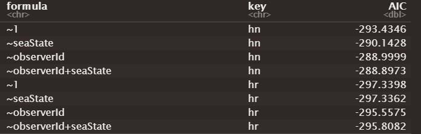
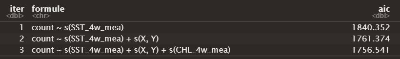

# Importations et transformation des données

```{r setup, include=FALSE}
rm(list=ls())

knitr::opts_chunk$set(
	echo = FALSE,
	fig.align = "center",
	message = FALSE,
	warning = FALSE,
	error = TRUE
)
```

```{r import_packages}
# Packages
library(dplyr)				# tidyverse
library(foreign)			# read.dbf
library(lubridate)		# dates

# Graphes packages
library(ggplot2) ; ggplot2::theme_set(theme_light())
library(ggmap)
library(viridis)

# Packages calcul
library(Distance)
library(dsm)

# Packages raster/carto
library(sp)
library(rgdal)
library(raster)
```

```{r import_donnees}
load("../data/effort_output.RData")
load("../data/list_prepare_obs_by_sp.RData")
load("../data/predata_output.RData")
gridata <- read.dbf("../data/SPEE_CAPECET_Grid2km_modified.dbf")
```

```{r}
# Jointure
distdata <- dplyr::left_join(list_prepare_obs_by_sp$PRIGLA_obs_output$obsdata,
																	 cov_segment <- predata_output$segdata,
																	 by = "Seg")

# Réarrangement des colonnes
distdata <- distdata[, c(3, 5:11, 1:2, 14:31)]
colnames(distdata)[1] = "Transect.Label"
colnames(distdata)[2] = "Seg"
colnames(distdata)[3] = "Sample.Label"

distdata$seaState = as.integer(distdata$seaState)
distdata$observerId <- as.integer(distdata$observerId)
```

```{r}
obsdata <- list_prepare_obs_by_sp$PRIGLA_obs_output$obsdata
```

```{r}
segdata <- effort_output$segdata
```

```{r}
predata <- predata_output$predata
```

On récupère les données suivantes :

-   `obsdata`, `segdate`et `predata`
-   `distdata`, une jointure entre predata et obsdata sur le segment

On centre et réduit les covariables (présentes dans `distdata`, `segdata` et `predata`).

```{r}
# distdata
for (i in 20:28){distdata[,i] <- scale(distdata[,i])}

# segdata
for (i in 16:23){segdata[,i] <- scale(segdata[,i])}

# predata
for (i in 6:14){predata[,i] <- scale(predata[,i])}
```

# Fonction de détection

Un algorithme a été écrit pour déterminer la meilleure fonction de détection. Cet algorithme teste, pour les deux distributions possibles (half-normal et hazard-rate), les différentes combinaisons de covariables possibles : aucune, le beaufort `seaState`, l'observateur `observerId` ou les deux. Pour chaque fonction de détection ajustée grâce aux données, on obtient l'AIC.

{style="align: center;" width="505"}

Pour la fonction avec le plus petit AIC (`hr` hazard-rate ; sans covariable), il y avait une erreur d'ajustement. On a donc choisi la fonction de détection avec le 2ème plus petit AIC (`hr` hazard-rate ; avec la covariable `seaState`).

```{r}
detfc.sea.hr <- Distance::ds(
						distdata,
						max(distdata$distance),
						formula = ~seaState,
						key = "hr")
```

```{r}
plot(detfc.sea.hr,
		 breaks = seq(0, max(distdata$distance), 0.02),
		 showpoints = FALSE,
		 pl.col = "lightblue", 
		 lwd = 2,
		 main = "Fonction de détection (key : hr, covariable : seaState)")
```

# Fonction de densité

## Choix des covariables de la fonction de densité

On créé une fonction `selec_dsm_aic_fwd` qui a permis de sélectionner de manière forward les covariables à inclure dans le modèle dsm sur un critère d'AIC. Cette fonction récursive ajoute à chaque étape la covariable permettant d'obtenir l'AIC le plus faible. Elle s'arrête lorsque l'ajout d'une covariable ne diminue plus l'AIC.

{style="align: center;" width="602"}

C'est le modèle 3 que nous avons retenu ici, avec les covariables suivantes :

-   température de la mer en moyenne les 4 semaines avant la session,
-   la localisation (interaction entre X et Y),
-   la teneur en chlorophylle en moyenne les 4 semaines avant la session.

> Les covariables ont été choisies en ajustant les modèles sur l'ensemble des données, sans distinction de session, pour avoir le même modèle pour les 2 sessions par la suite.

## Ajustement des modèles par session

6 modèles de densité ont été ajustés grâce à la fonction `dsm` :

-   Avec un biais de disponibilité constant à 1 : un modèle pour la session 2 et un pour la session 3
-   Avec un biais de disponibilité constant à 0.41 : un modèle pour la session 2 et un pour la session 3
-   Avec un biais de disponibilité dépendant de la profondeur : un modèle pour la session 2 et un pour la session 3

> On note "on-shelf" quand la profondeur est inférieure à 150m, et "off-shelf" si la profondeur est supérieure à 150m. $availability_{off shelf}=0,1357617$ et $availability_{on shelf}=0,6332016$

```{r}
## availability = 1
### Session 2 (mois 05 et 06)

segdata_tmp <- predata_output$segdata %>% filter(month(date) == 5 | month(date) == 6)
obsdata_tmp <- obsdata %>% filter(session == 2)

dsm_s2_av1 <- dsm(
				formula = count ~ s(SST_4w_mea) + s(X, Y) + s(CHL_4w_mea),
				ddf.obj = detfc.sea.hr,
				segment.data = segdata_tmp,
				observation.data = obsdata_tmp,
				method = 'REML',
				family = tw(),
				engine = 'gam',
				gamma = 1.4,
				availability = 1)


### Session 3 (mois 07 et 08)

segdata_tmp <- predata_output$segdata %>% filter(month(date) == 7 | month(date) == 8)
obsdata_tmp <- obsdata %>% filter(session == 3)

dsm_s3_av1 <- dsm(
				formula = count ~ s(SST_4w_mea) + s(X, Y) + s(CHL_4w_mea),
				ddf.obj = detfc.sea.hr,
				segment.data = segdata_tmp,
				observation.data = obsdata_tmp,
				method = 'REML',
				family = tw(),
				engine = 'gam',
				gamma = 1.4,
				availability = 1)

## dsm pour $availability = 0.41$

### Session 2 (mois 05 et 06)

segdata_tmp <- predata_output$segdata %>% filter(month(date) == 5 | month(date) == 6)
obsdata_tmp <- obsdata %>% filter(session == 2)

dsm_s2_av041 <- dsm(
				formula = count ~ s(SST_4w_mea) + s(X, Y) + s(CHL_4w_mea),
				ddf.obj = detfc.sea.hr,
				segment.data = segdata_tmp,
				observation.data = obsdata_tmp,
				method = 'REML',
				family = tw(),
				engine = 'gam',
				gamma = 1.4,
				availability = 0.41)


### Session 3 (mois 07 et 08)

segdata_tmp <- predata_output$segdata %>% filter(month(date) == 7 | month(date) == 8)
obsdata_tmp <- obsdata %>% filter(session == 3)

dsm_s3_av041 <- dsm(
				formula = count ~ s(SST_4w_mea) + s(X, Y) + s(CHL_4w_mea),
				ddf.obj = detfc.sea.hr,
				segment.data = segdata_tmp,
				observation.data = obsdata_tmp,
				method = 'REML',
				family = tw(),
				engine = 'gam',
				gamma = 1.4,
				availability = 0.41)

## dsm pour $availability$ dépendante de on-shelf et off-shelf

distdata$availability = NA
for (i in 1:nrow(distdata)) {
	if (distdata$depth[i] <= 150) {
		distdata$availability[i] = 0.6332016
	} else{
		distdata$availability[i] = 0.1357617
	}
}

### Session 2 (mois 05 et 06)

segdata_tmp <- predata_output$segdata %>% filter(month(date) == 5 | month(date) == 6)
obsdata_tmp <- obsdata %>% filter(session == 2)
availability <- (distdata %>% filter(session == 2))$availability

dsm_s2_avshelf <- dsm(
				formula = count ~ s(SST_4w_mea) + s(X, Y) + s(CHL_4w_mea),
				ddf.obj = detfc.sea.hr,
				segment.data = segdata_tmp,
				observation.data = obsdata_tmp,
				method = 'REML',
				family = tw(),
				engine = 'gam',
				gamma = 1.4,
				availability = availability)

### Session 3 (mois 07 et 08)

segdata_tmp <- predata_output$segdata %>% filter(month(date) == 7 | month(date) == 8)
obsdata_tmp <- obsdata %>% filter(session == 3)
availability <- (distdata %>% filter(session == 3))$availability

dsm_s3_avshelf <- dsm(
				formula = count ~ s(SST_4w_mea) + s(X, Y) + s(CHL_4w_mea),
				ddf.obj = detfc.sea.hr,
				segment.data = segdata_tmp,
				observation.data = obsdata_tmp,
				method = 'REML',
				family = tw(),
				engine = 'gam',
				gamma = 1.4,
				availability = availability)
```

On peut visualiser le modèle GAM ajusté. Par exemple, nous allons regarder le modèle pour la session 2 avec un biais de disponibilité constant fixé à 1.

```{r echo = TRUE}
plot_pred_by_term(dsm_s2_av1, 
									predata_output$predata, 
									c("longitude","latitude")) + scale_fill_viridis()
```

On remarque un manque de régularité surprenant dans la carte pour s(X, Y).

```{r fig.height = 8, echo = TRUE}
par(mfrow = c(2,2))
plot.gam(dsm_s2_av1)
```
> *Lignes pointillées : intervalle de confiance à 95% pour la forme moyenne de l'effet.*

# Abondance : résultats et cartes

L'abondance est calculée avec la fonction `predict` (`predict.dsm` du package `dsm`).

```{r}
dsm_s2_av1.pred <- predict(dsm_s2_av1, predata_output$predata, predata_output$predata$Area)
dsm_s3_av1.pred <- predict(dsm_s3_av1, predata_output$predata, predata_output$predata$Area)

dsm_s2_av041.pred <- predict(dsm_s2_av041, predata_output$predata, predata_output$predata$Area)
dsm_s3_av041.pred <- predict(dsm_s3_av041, predata_output$predata, predata_output$predata$Area)

dsm_s2_avshelf.pred <- predict(dsm_s2_avshelf, predata_output$predata, predata_output$predata$Area)
dsm_s3_avshelf.pred <- predict(dsm_s3_avshelf, predata_output$predata, predata_output$predata$Area)
```

## Résultats numériques

```{r echo=FALSE}
print("-------- Session 2 --------")
print(paste("Avec availaibility = 1, on estime qu'il y a", round(sum(dsm_s2_av1.pred)), "requins au total dans la zone."))
print(paste("Avec availaibility = 0.41, on estime qu'il y a", round(sum(dsm_s2_av041.pred)), "requins au total dans la zone."))
print(paste("Avec availaibility selon on/off shelf, on estime qu'il y a", round(sum(dsm_s2_avshelf.pred)), "requins au total dans la zone."))
```

```{r echo=FALSE}
print("-------- Session 3 --------")
print(paste("Avec availaibility = 1, on estime qu'il y a", round(sum(dsm_s3_av1.pred)), "requins au total dans la zone."))
print(paste("Avec availaibility = 0.41, on estime qu'il y a", round(sum(dsm_s3_av041.pred)), "requins au total dans la zone."))
print(paste("Avec availaibility selon on/off shelf, on estime qu'il y a", round(sum(dsm_s3_avshelf.pred)), "requins au total dans la zone."))
```

Les résultats nous surprennent, étant donné le peu de requins détectés, surtout pour la session 2. Il semble étrange d'estimer 125000 requins (avec un biais de disponibilité de 0,41) dans 14947 km².

## Carte d'abondance pour la session 2 et availability = 1

```{r fig.height = 8}
data_occ <- list_prepare_obs_by_sp$PRIGLA_obs_output$distdata %>% filter(detected == 1)

# Emplacement
sbbox <- make_bbox(lon = c(min(data_occ$longitude), max(data_occ$longitude)),
									 lat = c(min(data_occ$latitude), max(data_occ$latitude)),
									 f = 1)

# Création de la carte vide
zone_obs <- get_map(location = sbbox,
										zoom = 8,
										maptype = "terrain")

zone_obs_map = ggmap(zone_obs) + theme_void()

data_pred_carto = as.data.frame(cbind(x = predata$longitude, y = predata$latitude, abondance = dsm_s2_av1.pred))

zone_obs_map + 
	geom_raster(data = data_pred_carto ,#%>% filter(abondance < 10),
							aes(x = x, y = y, fill = abondance)) + 
  coord_fixed(ratio = 1) +
	geom_path(
		data = segdata,
		mapping = aes(x = longitude, y = latitude, group = Transect.Label),
		size = 0.3,
		colour = alpha("black", 0.2)) + 
	geom_point(data = data_occ, aes(x = longitude, y = latitude, col = session)) + 
	theme_void() + 
	scale_fill_viridis() +
	scale_color_manual(values = wesanderson::wes_palette("BottleRocket1", n = 4))
```

La carte est illisible : on a quelques points de la grille, d'environ 4 km², qui contiennent jusqu'à 300 requins d'après les estimations faites ici. Le reste des points contiennent très peu de requins.

On peut regarder le nombre requins estimés dans les 25 'cases' les plus peuplées :

```{r}
as.vector(dsm_s2_av1.pred %>% sort(decreasing = TRUE))[0:25]
```
Un résumé des données prédites par 'case' :

```{r}
summary(dsm_s2_av1.pred)
```