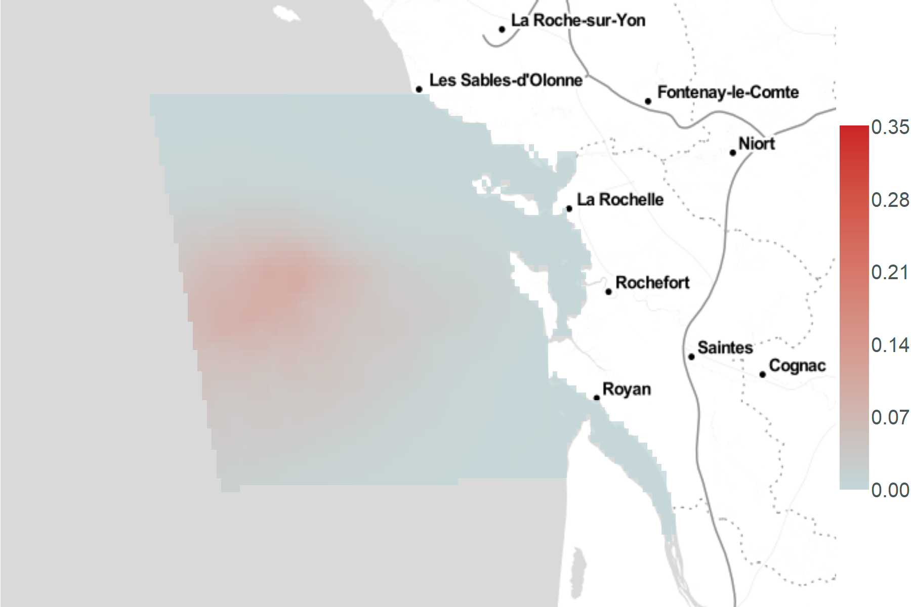
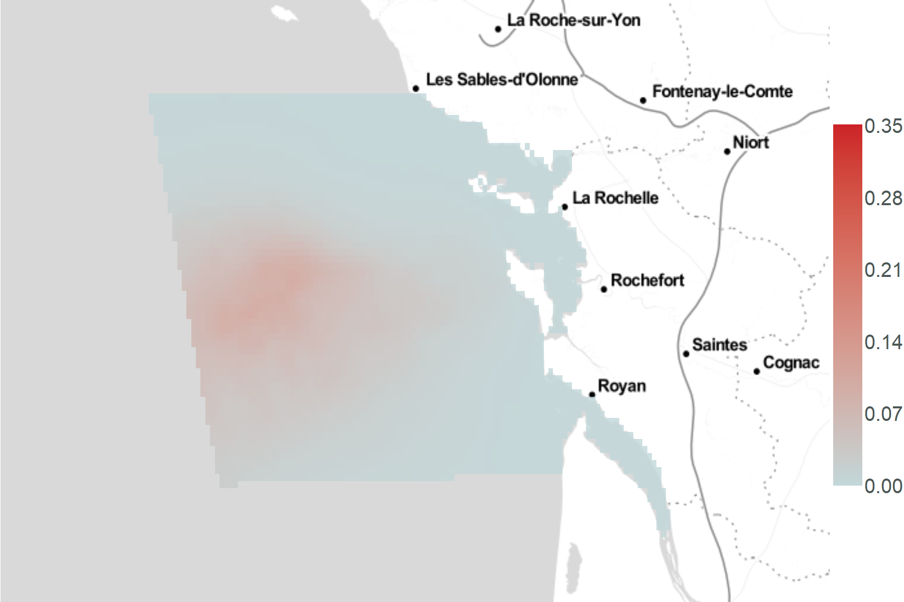
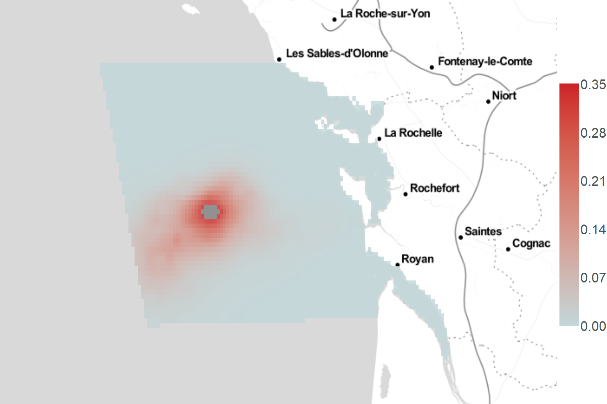

```{r setup, include=FALSE}
rm(list=ls())

knitr::opts_chunk$set(
	echo = TRUE,
	fig.align = "center",
	message = FALSE,
	warning = FALSE,
	error = TRUE
)
```

# Importations et transformation des données

## Importations

```{r import_packages}
# Packages
library(dplyr)				# tidyverse
library(foreign)			# read.dbf
library(lubridate)		# dates
library(data.table)

# Graphes packages
library(ggplot2) ; ggplot2::theme_set(theme_light())
library(ggmap)
library(viridis)
library(ggpubr)
library(plotly)

# Packages calcul
library(Distance)
library(dsm)

# Packages raster/carto
library(sp)
library(rgdal)
library(raster)
```

```{r import_donnees}
load("../data/effort_output.RData")
load("../data/list_prepare_obs_by_sp.RData")
load("../data/predata_output.RData")
gridata <- read.dbf("../data/SPEE_CAPECET_Grid2km_modified.dbf")
```

```{r import_functions}
# On importe les fonctions pour sélectionner les covariables (fonction de détection + dsm)
source("./fonctions/selec_detfc_aic.R")
source("./fonctions/selec_dsm_aic_fwd.R")

# On importe la fonction pred_splines
source("./fonctions/pred_splines.R")

# On importe les fonctions get_map_abundance
source("./fonctions/get_map_abundance.R")
source("./fonctions/get_map_abundance_extr.R")
```

## Sélection des données

```{r}
# Jointure
distdata <- dplyr::left_join(list_prepare_obs_by_sp$PRIGLA_obs_output$obsdata,
																	 cov_segment <- predata_output$segdata,
																	 by = "Seg")

# Réarrangement des colonnes
distdata <- distdata[, c(3, 5:11, 1:2, 14:31)]
colnames(distdata)[1] = "Transect.Label"
colnames(distdata)[2] = "Seg"
colnames(distdata)[3] = "Sample.Label"
colnames(distdata)[5] = "session"


distdata$seaState = as.integer(distdata$seaState)
distdata$observerId <- as.integer(distdata$observerId)

# Changement de l'ordre des colonnes pour garder le même ordre pour les covariables que segdata
distdata <- distdata[, c(1:19, 24:28, 20:23)]
```

```{r}
obsdata <- list_prepare_obs_by_sp$PRIGLA_obs_output$obsdata
```

```{r}
segdata <- effort_output$segdata
```

```{r}
predata <- predata_output$predata
predata$session <- factor(predata$session)
unique(predata$session)

# Changement de l'ordre des colonnes pour garder le même ordre pour les covariables que segdata
predata <- predata[, c(1:6, 11:15, 7:10)]
```

On récupère les données suivantes :

-   `obsdata`, `segdate`et `predata`
-   `distdata`, une jointure entre predata et obsdata sur le segment

## Centrage-réduction

On centre et réduit les covariables (présentes dans `distdata`, `segdata` et `predata`).

```{r}
# On récupère mean et sd de segdata pour les colonnes 15 à 23
cov_names_mean_sd <- matrix(rep(NA, 9*2), ncol = 9)
colnames(cov_names_mean_sd) <- names(segdata[, 15:23])
rownames(cov_names_mean_sd) <- c("mean", "sd")

# moyenne
for (i in 1:9){
	cov_names_mean_sd[1,i] = mean(segdata[,i+14], na.rm = TRUE)
}
# sd
for (i in 1:9){
	cov_names_mean_sd[2,i] = sd(segdata[,i+14], na.rm = TRUE)
}
cov_names_mean_sd

# On centre-réduit les données de segdata, distdata et predata avec la moyenne et l'écart type de chaque covariable dans segdata

# segdata
for (i in 1:9){
	# On récupère la colonne du jeu de données non centré-réduit
	column <- as.data.frame(segdata[, grep(colnames(cov_names_mean_sd)[i], colnames(segdata))])
	
	# On récupère la moyenne et l'écart type pour cette covariable
	mean_cov <- cov_names_mean_sd[1, grep(colnames(cov_names_mean_sd)[i], colnames(cov_names_mean_sd))]
	sd_cov <- cov_names_mean_sd[2, grep(colnames(cov_names_mean_sd)[i], colnames(cov_names_mean_sd))]
	
	# On applique le centrage-réduction
	column <- apply(X = column, 
									MARGIN = 1, 
									FUN =  function(valeur){
										return((valeur - mean_cov)/sd_cov)
									}
	)
	segdata[i+14] = column
}

# distdata
for (i in 1:9){
	# On récupère la colonne du jeu de données non centré-réduit
	column <- as.data.frame(distdata[, grep(colnames(cov_names_mean_sd)[i], colnames(distdata))])
	
	# On récupère la moyenne et l'écart type pour cette covariable
	mean_cov <- cov_names_mean_sd[1, grep(colnames(cov_names_mean_sd)[i], colnames(cov_names_mean_sd))]
	sd_cov <- cov_names_mean_sd[2, grep(colnames(cov_names_mean_sd)[i], colnames(cov_names_mean_sd))]
	
	# On applique le centrage-réduction
	column <- apply(X = column, 
									MARGIN = 1, 
									FUN =  function(valeur){
										return((valeur - mean_cov)/sd_cov)
									}
	)
	distdata[i+19] = column
}

# predata
for (i in 1:9){
	# On récupère la colonne du jeu de données non centré-réduit
	column <- as.data.frame(predata[, grep(colnames(cov_names_mean_sd)[i], colnames(predata))])
	
	# On récupère la moyenne et l'écart type pour cette covariable
	mean_cov <- cov_names_mean_sd[1, grep(colnames(cov_names_mean_sd)[i], colnames(cov_names_mean_sd))]
	sd_cov <- cov_names_mean_sd[2, grep(colnames(cov_names_mean_sd)[i], colnames(cov_names_mean_sd))]
	
	# On applique le centrage-réduction
	column <- apply(X = column, 
									MARGIN = 1, 
									FUN =  function(valeur){
										return((valeur - mean_cov)/sd_cov)
									}
	)
	predata[i+6] = column
}
```

## Longitude, latitude en X et Y en lambert93

`predata`

```{r}
predata_save <- predata

## On récupère les coordonnées et on les transforme en Lambert 93
coordinates(predata) <- c("longitude", "latitude")
proj4string(predata) <- CRS("+init=epsg:4326") # Actuellement, epsg = 4326 : WGS84

## On créé un predata temporaire avec toutes les informations nécessaires
predata_l93 <- spTransform(predata, CRS("+init=epsg:2154")) # on veut, epsg = 2154 : Lambert93

## On récupère les coordonnées en X et Y
coord_l93 <- as.data.frame(coordinates(predata_l93))

## On remplace dans predata les X, Y faux par les nouvelles coordonnées X, Y en L93
predata <- predata_save
predata$X <- coord_l93$longitude
predata$Y <- coord_l93$latitude
```

`distdata`

```{r}
distdata_save <- distdata

## On récupère les coordonnées et on les transforme en Lambert 93
coordinates(distdata) <- c("longitude", "latitude")
proj4string(distdata) <- CRS("+init=epsg:4326") # Actuellement, epsg = 4326 : WGS84

## On créé un predata temporaire avec toutes les informations nécessaires
distdata_l93 <- spTransform(distdata, CRS("+init=epsg:2154")) # on veut, epsg = 2154 : Lambert93

## On récupère les coordonnées en X et Y
coord_l93 <- as.data.frame(coordinates(distdata_l93))

## On remplace dans predata les X, Y faux par les nouvelles coordonnées X, Y en L93
distdata <- distdata_save
distdata$X <- coord_l93$longitude
distdata$Y <- coord_l93$latitude
```

`gridata`

```{r}
gridata_save <- gridata
## On récupère les coordonnées et on les transforme en Lambert 93
coordinates(gridata) <- c("lon", "lat")
proj4string(gridata) <- CRS("+init=epsg:4326") # Actuellement, epsg = 4326 : WGS84

## On créé un predata temporaire avec toutes les informations nécessaires
gridata_l93 <- spTransform(gridata, CRS("+init=epsg:2154")) # on veut, epsg = 2154 : Lambert93

## On récupère les coordonnées en X et Y
coord_l93 <- as.data.frame(coordinates(gridata_l93))

## On remplace dans predata les X, Y faux par les nouvelles coordonnées X, Y en L93
gridata <- gridata_save
gridata$X <- coord_l93$lon
gridata$Y <- coord_l93$lat
```

```{r echo=FALSE}
# Nettoyage de l'environnement
rm(list = c("coord_l93", "cov_names_mean_sd", "cov_segment",
						"distata_l93", "effort_output", "list_prepare_obs_by_sp",
						"distdata_l93", "predata_l93", "gridata_l93",
						"predata_output", "column", "i", "mean_cov", "sd_cov",
						"gridata_save", "predata_save", "obsdata_save", "distdata_save"))
```


# Fonction de détection

```{r}
detfc.sea.hr <- Distance::ds(
						distdata,
						max(distdata$distance),
						formula = ~seaState,
						key = "hr")

summary(detfc.sea.hr)
```

## plot 
```{r}
plot(
	detfc.sea.hr,
	hazard.params = list(xvar = distdata$distance, alpha = 0.02),
	lwd = 3,
	showpoints = F,
	pl.col = "lightblue",
	xlab = "",
	ylab = "",
	border = T
)
add_df_covar_line(detfc.sea.hr, data.frame(seaState = na.omit(unique(distdata$seaState))), lwd=2, pdf = TRUE)

legend(x = 0.2, y = 1, legend = c("0", "1", "2", "3"), lty=2:5)
```

## Recherche des paramètres adéquats

### shape coefficient : b ; scale coef = Sigma

Exemple de l'article sur distance (ici)[https://www.biorxiv.org/content/10.1101/063891v1.full.pdf]


```{r}
# On récupère l'ensemble des paramètres du modèle d'abord
detfc_par <- detfc.sea.hr$ddf$par

# scale.value : fonction de mise à l'échelle des paramètres du modèle (matrice et exponentielle)
scale.value <- function (param, z){
	exp(as.matrix(z) %*% param) }

# key.fct.hz : On entre une distance, un sigma (scale), un b (shape) et on obtient une probabilité de détection pour une hazard-rate
key.fct.hr <- function (distance, sigma, b){
	return(1 - exp(-(distance / sigma) ^ (-b))) }

# On créé un vecteur des distances de 0 à 0.3 km
dist <- seq(from = 0, to = 0.3, length.out = 96)

# On récupère le paramètre shape (b) et on le met à l'échelle : 100 fois exp(b)
b <- scale.value(detfc_par["V1"], matrix(1, nrow = 96, 1))

# On va ensuite récupérer le paramètre scale (sigma)
# C'est plus compliqué ici, car sigma varie selon les covariables de détection, donc seaState ici.

# sigma.0 : intercept
sigma0 <- scale.value(detfc_par[2:3], # 2 paramètres : sigma intercept + sigma seaState = 0
											z = matrix(c(rep(1, 96), rep(0, 96)), ncol = 2))

# sigma.1 : intercept + seaState toujours à 1
sigma1 <- scale.value(detfc_par[2:3], # 2 paramètres : sigma intercept + sigma seaState = 1
											z = matrix(rep(1, 96*2), ncol = 2))

# sigma.2 : intercept + seaState toujours à 2
sigma2 <- scale.value(detfc_par[2:3], # 2 paramètres : sigma intercept + sigma seaState constant à 2
											z = matrix(c(rep(1, 96), rep(2, 96)), ncol = 2))

# sigma.3 : intercept + seaState toujours à 3
sigma3 <- scale.value(detfc_par[2:3], # 2 paramètres : sigma intercept + sigma seaState constant à 2
											z = matrix(c(rep(1, 96), rep(3, 96)), ncol = 2))


# A partir de tous ces paramètres et du vecteur des distances, on calcule la probabilité de détection
proba_detec0 <- key.fct.hr(distance = dist, sigma = sigma0, b = b)
proba_detec1 <- key.fct.hr(distance = dist, sigma = sigma1, b = b)
proba_detec2 <- key.fct.hr(distance = dist, sigma = sigma2, b = b)
proba_detec3 <- key.fct.hr(distance = dist, sigma = sigma3, b = b)
```

```{r }
plot(	detfc.sea.hr,
	showpoints = F,
	pl.col = "white",
	border = F,
	main = "plot.ds"
)
grid()
add_df_covar_line(detfc.sea.hr, data.frame(seaState = na.omit(unique(distdata$seaState))), lwd=2, pdf = TRUE)

legend(x = 0.2, y = 1, legend = c("0", "1", "2", "3"), lty=2:5)


ggplot() +
	geom_line(data = data.frame(x = dist, y = proba_detec0), aes(x = x, y = y), lty = 2, size = 2) +
	geom_line(data = data.frame(x = dist, y = proba_detec1), aes(x = x, y = y), lty = 3, size = 2) +
	geom_line(data = data.frame(x = dist, y = proba_detec2), aes(x = x, y = y), lty = 4, size = 2) +
	geom_line(data = data.frame(x = dist, y = proba_detec3), aes(x = x, y = y), lty = 5, size = 2)
```

```{r}
g.herm.cov <- function(y, param, beaufort){
	# Paramètres
  b <- param[1]
  nu <- param[2] + beaufort*param[3]
  sigma   <- exp(nu)

  key     <- exp(-y^2/(2*sigma^2))
  key0    <- exp(-(0)^2/(2*sigma^2))
  serie   <- 1+exp(param[12]*(x^4-6*x^2+3))  # following Distance 7.0 User's manual p.101, Hermite polynomial of order 4 is : x^4-6*x^2+3
  serie0  <- 1+exp(param[12]*(0^4-6*0^2+3))
  pdet    <- key*(1+serie)/(key0*(1+serie0))
  return(pdet)
}
```


```{r}
all_param_seaState <-
	as.data.frame(cbind(detfc.sea.hr[["ddf"]][["ds"]][["aux"]][["ddfobj"]][["scale"]][["dm"]],
				"param" = detfc.sea.hr[["ddf"]][["fitted"]]))

sigma.0 <- scale.value((all_param_seaState %>% filter(seaState == 0))$param %>% unique(),
											 z = matrix(1, nrow = 96, 1))
sigma.1 <- (all_param_seaState %>% filter(seaState == 1))$param %>% unique()
sigma.2 <- (all_param_seaState %>% filter(seaState == 2))$param %>% unique()
sigma.3 <- (all_param_seaState %>% filter(seaState == 3))$param %>% unique()

par(mfrow = c(2, 2))
plot(x = dist, 
		 y = key.fct.hr(distance = dist, sigma = sigma.0, b = b),
		 type = "l")
grid()

plot(x = dist, 
		 y = key.fct.hr(distance = dist, sigma = sigma.1, b = b),
		 type = "l")
grid()

plot(x = dist, 
		 y = key.fct.hr(distance = dist, sigma = sigma.2, b = b),
		 type = "l")
grid()

plot(x = dist, 
		 y = key.fct.hr(distance = dist, sigma = sigma.3, b = b),
		 type = "l")
grid()
```


# Fonction de densité (covariables communes par session)


## Ajustement de la fonction de densité

> dsm pour $availability$ dépendante de on-shelf et off-shelf : On note "on-shelf" quand la profondeur est inférieure à 150m, et "off-shelf" si la profondeur est supérieure à 150m.

$$availability_{off-shelf}=0,1357617$$
$$availability_{on-shelf}=0,6332016$$

```{r}
segdata_tmp <- segdata %>% filter(month(date) == 5 | month(date) == 6)
obsdata_tmp <- obsdata %>% filter(session == 2)

# On choisit s(X, Y)
dsm_s2_av1 <- dsm(
				formula = count ~ s(SST_4w_mea) + s(X, Y) + s(CHL_4w_mea),
				ddf.obj = detfc.sea.hr,
				segment.data = segdata_tmp,
				observation.data = obsdata_tmp,
				method = 'REML',
				family = nb(),
				engine = 'gam',
				gamma = 1.4,
				availability = 1)


segdata_tmp <- segdata %>% filter(month(date) == 7 | month(date) == 8)
obsdata_tmp <- obsdata %>% filter(session == 3)

dsm_s3_av1 <- dsm(
				formula = count ~ s(SST_4w_mea) + s(X, Y) + s(CHL_4w_mea),
				ddf.obj = detfc.sea.hr,
				segment.data = segdata_tmp,
				observation.data = obsdata_tmp,
				method = 'REML',
				family = nb(),
				engine = 'gam',
				gamma = 1.4,
				availability = 1)


segdata_tmp <- segdata %>% filter(month(date) == 5 | month(date) == 6)
obsdata_tmp <- obsdata %>% filter(session == 2)

dsm_s2_av041 <- dsm(
				formula = count ~ s(SST_4w_mea) + s(X, Y) + s(CHL_4w_mea),
				ddf.obj = detfc.sea.hr,
				segment.data = segdata_tmp,
				observation.data = obsdata_tmp,
				method = 'REML',
				family = nb(),
				engine = 'gam',
				gamma = 1.4,
				availability = 0.41)


segdata_tmp <- segdata %>% filter(month(date) == 7 | month(date) == 8)
obsdata_tmp <- obsdata %>% filter(session == 3)

dsm_s3_av041 <- dsm(
				formula = count ~ s(SST_4w_mea) + s(X, Y) + s(CHL_4w_mea),
				ddf.obj = detfc.sea.hr,
				segment.data = segdata_tmp,
				observation.data = obsdata_tmp,
				method = 'REML',
				family = nb(),
				engine = 'gam',
				gamma = 1.4,
				availability = 0.41)

# On-shelf/off-shelf

distdata$availability = NA
for (i in 1:nrow(distdata)) {
	if (distdata$depth[i] <= 150) {
		distdata$availability[i] = 0.6332016
	} else{
		distdata$availability[i] = 0.1357617
	}
}

segdata_tmp <- segdata %>% filter(month(date) == 5 | month(date) == 6)
obsdata_tmp <- obsdata %>% filter(session == 2)
availability <- (distdata %>% filter(session == 2))$availability

dsm_s2_avshelf <- dsm(
				formula = count ~ s(SST_4w_mea) + s(X, Y) + s(CHL_4w_mea),
				ddf.obj = detfc.sea.hr,
				segment.data = segdata_tmp,
				observation.data = obsdata_tmp,
				method = 'REML',
				family = nb(),
				engine = 'gam',
				gamma = 1.4,
				availability = availability)

segdata_tmp <- segdata %>% filter(month(date) == 7 | month(date) == 8)
obsdata_tmp <- obsdata %>% filter(session == 3)
availability <- (distdata %>% filter(session == 3))$availability

dsm_s3_avshelf <- dsm(
				formula = count ~ s(SST_4w_mea) + s(X, Y) + s(CHL_4w_mea),
				ddf.obj = detfc.sea.hr,
				segment.data = segdata_tmp,
				observation.data = obsdata_tmp,
				method = 'REML',
				family = nb(),
				engine = 'gam',
				gamma = 1.4,
				availability = availability)
```

# Prédiction de l'abondance

```{r}
predata_tmp2 <- predata %>% filter(session == 2)
predata_tmp3 <- predata %>% filter(session == 3)

dsm_s2_av1.pred <- predict(dsm_s2_av1, predata_tmp2, predata_tmp2$Area, se.fit = TRUE)
dsm_s3_av1.pred <- predict(dsm_s3_av1, predata_tmp3, predata_tmp3$Area, se.fit = TRUE)

dsm_s2_av041.pred <- predict(dsm_s2_av041, predata_tmp2, predata_tmp2$Area, se.fit = TRUE)
dsm_s3_av041.pred <- predict(dsm_s3_av041, predata_tmp3, predata_tmp3$Area, se.fit = TRUE)

dsm_s2_avshelf.pred <- predict(dsm_s2_avshelf, predata_tmp2, predata_tmp2$Area, se.fit = TRUE)
dsm_s3_avshelf.pred <- predict(dsm_s3_avshelf, predata_tmp3, predata_tmp3$Area, se.fit = TRUE)
```

## Comparaison des résultats selon la valeur de disponibilité

```{r}
res_abondance <- data.frame(
	"Session" = c(2, 3, 2, 3, 2, 3),
	"Disponibilité" = c("1", "1", "0.41", "0.41", "on-shelf/off-shelf", "on-shelf/off-shelf"),
	"Min" = c(
		sum(dsm_s2_av1.pred$fit - (dsm_s2_av1.pred$se.fit)),
		sum(dsm_s3_av1.pred$fit - (dsm_s3_av1.pred$se.fit)),
		sum(dsm_s2_av041.pred$fit - (dsm_s2_av1.pred$se.fit)),
		sum(dsm_s3_av041.pred$fit - (dsm_s3_av1.pred$se.fit)),
		sum(dsm_s2_avshelf.pred$fit - (dsm_s2_av1.pred$se.fit)),
		sum(dsm_s3_avshelf.pred$fit - (dsm_s3_av1.pred$se.fit))
	),
	"Estimation" = c(
		sum(dsm_s2_av1.pred$fit),
		sum(dsm_s3_av1.pred$fit),
		sum(dsm_s2_av041.pred$fit),
		sum(dsm_s3_av041.pred$fit),
		sum(dsm_s2_avshelf.pred$fit),
		sum(dsm_s3_avshelf.pred$fit)
	),
	"Max" = c(
		sum(dsm_s2_av1.pred$fit + (dsm_s2_av1.pred$se.fit)),
		sum(dsm_s3_av1.pred$fit + (dsm_s3_av1.pred$se.fit)),
		sum(dsm_s2_av041.pred$fit + (dsm_s2_av1.pred$se.fit)),
		sum(dsm_s3_av041.pred$fit + (dsm_s3_av1.pred$se.fit)),
		sum(dsm_s2_avshelf.pred$fit + (dsm_s2_av1.pred$se.fit)),
		sum(dsm_s3_avshelf.pred$fit + (dsm_s3_av1.pred$se.fit))
	)
)

data.table::data.table(res_abondance)
```
```{r}
res_abondance <- data.frame(
	"Session" = c(2, 3, 2, 3, 2, 3),
	"Disponibilité" = c("1", "1", "0.41", "0.41", "on-shelf/off-shelf", "on-shelf/off-shelf"),
	"Estimation" = c(
		sum(dsm_s2_av1.pred$fit),
		sum(dsm_s3_av1.pred$fit),
		sum(dsm_s2_av041.pred$fit),
		sum(dsm_s3_av041.pred$fit),
		sum(dsm_s2_avshelf.pred$fit),
		sum(dsm_s3_avshelf.pred$fit)
	),
	"Plus ou moins" = c(
		sum(dsm_s2_av1.pred$se.fit),
		sum(dsm_s3_av1.pred$se.fit),
		sum(dsm_s2_av041.pred$se.fit),
		sum(dsm_s3_av041.pred$se.fit),
		sum(dsm_s2_avshelf.pred$se.fit),
		sum(dsm_s3_avshelf.pred$se.fit)
	)
)

data.table::data.table(res_abondance)
```


## Cartes

```{r}
# Création de la carte vide
empty.map <- ggmap(get_stamenmap(
	bbox = make_bbox(
		lon = c(min(distdata$longitude), max(distdata$longitude)+0.8),
		lat = c(min(distdata$latitude), max(distdata$latitude)),
		f = 0.4
	),
	zoom = 8,
	maptype = "toner-lite"
))
```

### Session 2 et availability = 1

```{r}
map <- get_map_abundance(
	empty.map = empty.map,
	dsm.pred = dsm_s2_av1.pred$fit,
	predata_tmp = predata_tmp2,
	session_selec = 2,
	segdata = segdata,
	distdata = distdata,
	abondance = TRUE,
	transects = FALSE,
	observations = FALSE,
	poster = TRUE
)

png("./img/dsm_s2_av1.pred.png",
		width = 1800,
		height = 1200)
map
dev.off()
```




### Session 3 et availability = 1

```{r}
map <- get_map_abundance(
	empty.map = empty.map,
	dsm.pred = dsm_s3_av1.pred$fit,
	predata_tmp = predata_tmp3,
	session_selec = 3,
	segdata = segdata,
	distdata = distdata,
	abondance = TRUE,
	transects = FALSE,
	observations = FALSE,
	poster = TRUE
)

png("./img/dsm_s3_av1.pred.png", width = 1800, height = 1200)
map
dev.off()
```


### Session 2 et availability = 0.41

```{r}
map <- get_map_abundance(
	empty.map = empty.map,
	dsm.pred = dsm_s2_av041.pred$fit,
	predata_tmp = predata_tmp2,
	session_selec = 2,
	segdata = segdata,
	distdata = distdata,
	abondance = TRUE,
	transects = FALSE,
	observations = FALSE,
	poster = TRUE
)

png("./img/dsm_s2_av041.pred.png", width = 1800, height = 1200)
map
dev.off()
```



### Session 3 et availability = 0.41

```{r}
map <- get_map_abundance(
	empty.map = empty.map,
	dsm.pred = dsm_s3_av041.pred$fit,
	predata_tmp = predata_tmp3,
	session_selec = 3,
	segdata = segdata,
	distdata = distdata,
	abondance = TRUE,
	transects = FALSE,
	observations = FALSE,
	poster = TRUE
)

png("./img/dsm_s3_av041.pred.png",
		width = 1800,
		height = 1200)
map
dev.off()
```




### Session 2 et availability = off/on shelf

```{r}
map <- get_map_abundance(
	empty.map = empty.map,
	dsm.pred = dsm_s2_avshelf.pred$fit,
	predata_tmp = predata_tmp2,
	session_selec = 2,
	segdata = segdata,
	distdata = distdata,
	abondance = TRUE,
	transects = FALSE,
	observations = FALSE,
	poster = TRUE
)

png("./img/dsm_s2_avshelf.pred.png",
		width = 1800,
		height = 1200)
map
dev.off()
```


### Session 3 et availability = off/on shelf

```{r}
map <- get_map_abundance(
	empty.map = empty.map,
	dsm.pred = dsm_s3_avshelf.pred$fit,
	predata_tmp = predata_tmp3,
	session_selec = 3,
	segdata = segdata,
	distdata = distdata,
	abondance = TRUE,
	transects = FALSE,
	observations = FALSE,
	poster = TRUE
)
map

png("./img/dsm_s3_avshelf.pred.png",
		width = 1800,
		height = 1200)
map
dev.off()
```


## Carte pour l'appli

```{r}
map2 <- get_map_abundance(
	empty.map = empty.map,
	dsm.pred = dsm_s3_avshelf.pred$fit,
	predata_tmp = predata_tmp3,
	session_selec = 3,
	segdata = segdata,
	distdata = distdata,
	abondance = TRUE,
	transects = TRUE,
	observations = TRUE,
	poster = FALSE
)
map2
```

# Exportation des résultats en Rdata

```{r}
# Fonction de détection
save(detfc.sea.hr,
		 file = "resultats/detfc.Rdata")

# Modèles : dsm
save(dsm_s2_av1, dsm_s2_av041, dsm_s2_avshelf,
		 dsm_s3_av1, dsm_s3_av041, dsm_s3_avshelf,
		 file = "resultats/modeles_dsm.RData")

# Résultats de la prédiction : dsm.pred
save(dsm_s2_av1.pred, dsm_s2_av041.pred, dsm_s2_avshelf.pred,
		 dsm_s3_av1.pred, dsm_s3_av041.pred, dsm_s3_avshelf.pred,
		 file = "resultats/modeles_dsm.pred.RData")

# Données nettoyées
save(obsdata, predata, predata_tmp2, predata_tmp3, segdata, distdata,
		 file = "../data/donnees_nettoyees.RData")
```
