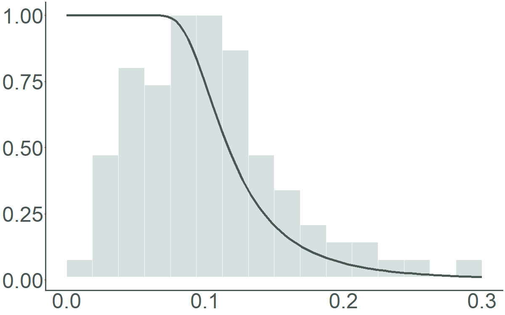
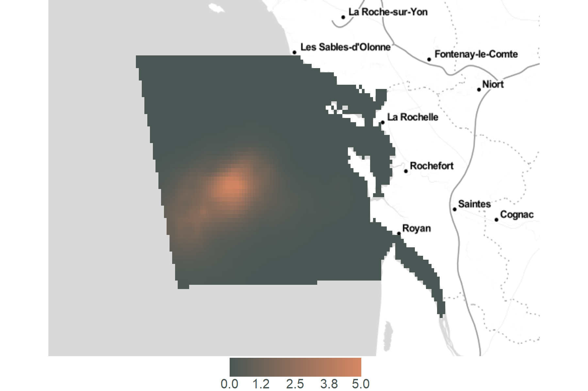
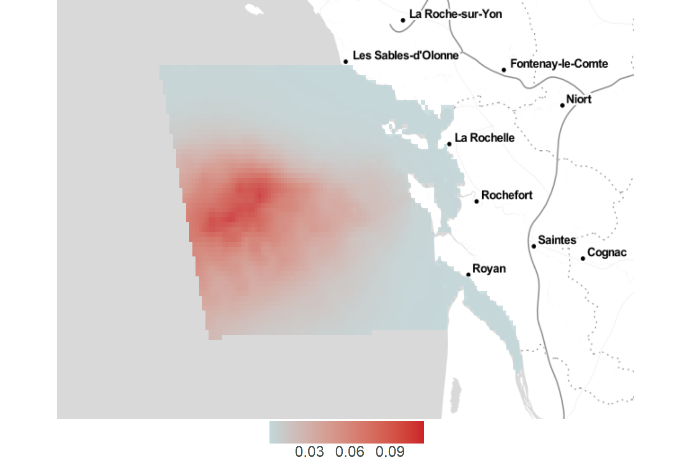
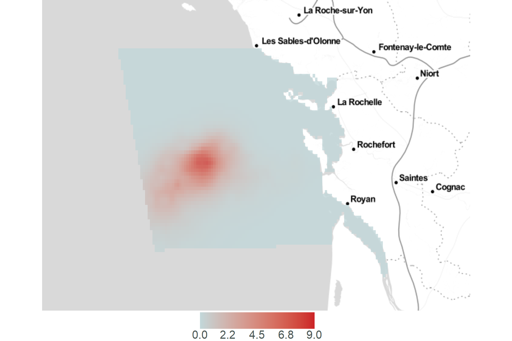

```{r setup, include=FALSE}
rm(list=ls())

knitr::opts_chunk$set(
	echo = TRUE,
	fig.align = "center",
	message = FALSE,
	warning = FALSE,
	error = TRUE
)
```

# Importations et transformation des données

## Importations

```{r import_packages}
# Packages
library(dplyr)				# tidyverse
library(foreign)			# read.dbf
library(lubridate)		# dates

# Graphes packages
library(ggplot2) ; ggplot2::theme_set(theme_light())
library(ggmap)
library(viridis)
library(ggpubr)
library(plotly)

# Packages calcul
library(Distance)
library(dsm)

# Packages raster/carto
library(sp)
library(rgdal)
library(raster)
```

```{r import_donnees}
load("../data/effort_output.RData")
load("../data/list_prepare_obs_by_sp.RData")
load("../data/predata_output.RData")
gridata <- read.dbf("../data/SPEE_CAPECET_Grid2km_modified.dbf")
```

```{r import_functions}
# On importe les fonctions pour sélectionner les covariables (fonction de détection + dsm)
source("./fonctions/selec_detfc_aic.R")
source("./fonctions/selec_dsm_aic_fwd.R")

# On importe la fonction pred_splines
source("./fonctions/pred_splines.R")

# On importe les fonctions get_map_abundance
source("./fonctions/get_map_abundance.R")
source("./fonctions/get_map_abundance_extr.R")
```

## Sélection des données

```{r}
# Jointure
distdata <- dplyr::left_join(list_prepare_obs_by_sp$PRIGLA_obs_output$obsdata,
																	 cov_segment <- predata_output$segdata,
																	 by = "Seg")

# Réarrangement des colonnes
distdata <- distdata[, c(3, 5:11, 1:2, 14:31)]
colnames(distdata)[1] = "Transect.Label"
colnames(distdata)[2] = "Seg"
colnames(distdata)[3] = "Sample.Label"
colnames(distdata)[5] = "session"


distdata$seaState = as.integer(distdata$seaState)
distdata$observerId <- as.integer(distdata$observerId)

# Changement de l'ordre des colonnes pour garder le même ordre pour les covariables que segdata
distdata <- distdata[, c(1:19, 24:28, 20:23)]
```

```{r}
obsdata <- list_prepare_obs_by_sp$PRIGLA_obs_output$obsdata
```

```{r}
segdata <- effort_output$segdata
```

```{r}
predata <- predata_output$predata
predata$session <- factor(predata$session)
unique(predata$session)

# Changement de l'ordre des colonnes pour garder le même ordre pour les covariables que segdata
predata <- predata[, c(1:6, 11:15, 7:10)]
```

On récupère les données suivantes :

-   `obsdata`, `segdate`et `predata`
-   `distdata`, une jointure entre predata et obsdata sur le segment

## Centrage-réduction

On centre et réduit les covariables (présentes dans `distdata`, `segdata` et `predata`).

```{r}
# On récupère mean et sd de segdata pour les colonnes 15 à 23
cov_names_mean_sd <- matrix(rep(NA, 9*2), ncol = 9)
colnames(cov_names_mean_sd) <- names(segdata[, 15:23])
rownames(cov_names_mean_sd) <- c("mean", "sd")

# moyenne
for (i in 1:9){
	cov_names_mean_sd[1,i] = mean(segdata[,i+14], na.rm = TRUE)
}
# sd
for (i in 1:9){
	cov_names_mean_sd[2,i] = sd(segdata[,i+14], na.rm = TRUE)
}
cov_names_mean_sd

# On centre-réduit les données de segdata, distdata et predata avec la moyenne et l'écart type de chaque covariable dans segdata

# segdata
for (i in 1:9){
	# On récupère la colonne du jeu de données non centré-réduit
	column <- as.data.frame(segdata[, grep(colnames(cov_names_mean_sd)[i], colnames(segdata))])
	
	# On récupère la moyenne et l'écart type pour cette covariable
	mean_cov <- cov_names_mean_sd[1, grep(colnames(cov_names_mean_sd)[i], colnames(cov_names_mean_sd))]
	sd_cov <- cov_names_mean_sd[2, grep(colnames(cov_names_mean_sd)[i], colnames(cov_names_mean_sd))]
	
	# On applique le centrage-réduction
	column <- apply(X = column, 
									MARGIN = 1, 
									FUN =  function(valeur){
										return((valeur - mean_cov)/sd_cov)
									}
	)
	segdata[i+14] = column
}

# distdata
for (i in 1:9){
	# On récupère la colonne du jeu de données non centré-réduit
	column <- as.data.frame(distdata[, grep(colnames(cov_names_mean_sd)[i], colnames(distdata))])
	
	# On récupère la moyenne et l'écart type pour cette covariable
	mean_cov <- cov_names_mean_sd[1, grep(colnames(cov_names_mean_sd)[i], colnames(cov_names_mean_sd))]
	sd_cov <- cov_names_mean_sd[2, grep(colnames(cov_names_mean_sd)[i], colnames(cov_names_mean_sd))]
	
	# On applique le centrage-réduction
	column <- apply(X = column, 
									MARGIN = 1, 
									FUN =  function(valeur){
										return((valeur - mean_cov)/sd_cov)
									}
	)
	distdata[i+19] = column
}

# predata
for (i in 1:9){
	# On récupère la colonne du jeu de données non centré-réduit
	column <- as.data.frame(predata[, grep(colnames(cov_names_mean_sd)[i], colnames(predata))])
	
	# On récupère la moyenne et l'écart type pour cette covariable
	mean_cov <- cov_names_mean_sd[1, grep(colnames(cov_names_mean_sd)[i], colnames(cov_names_mean_sd))]
	sd_cov <- cov_names_mean_sd[2, grep(colnames(cov_names_mean_sd)[i], colnames(cov_names_mean_sd))]
	
	# On applique le centrage-réduction
	column <- apply(X = column, 
									MARGIN = 1, 
									FUN =  function(valeur){
										return((valeur - mean_cov)/sd_cov)
									}
	)
	predata[i+6] = column
}
```

## Longitude, latitude en X et Y en lambert93

`predata`

```{r}
predata_save <- predata

## On récupère les coordonnées et on les transforme en Lambert 93
coordinates(predata) <- c("longitude", "latitude")
proj4string(predata) <- CRS("+init=epsg:4326") # Actuellement, epsg = 4326 : WGS84

## On créé un predata temporaire avec toutes les informations nécessaires
predata_l93 <- spTransform(predata, CRS("+init=epsg:2154")) # on veut, epsg = 2154 : Lambert93

## On récupère les coordonnées en X et Y
coord_l93 <- as.data.frame(coordinates(predata_l93))

## On remplace dans predata les X, Y faux par les nouvelles coordonnées X, Y en L93
predata <- predata_save
predata$X <- coord_l93$longitude
predata$Y <- coord_l93$latitude
```

`distdata`

```{r}
distdata_save <- distdata

## On récupère les coordonnées et on les transforme en Lambert 93
coordinates(distdata) <- c("longitude", "latitude")
proj4string(distdata) <- CRS("+init=epsg:4326") # Actuellement, epsg = 4326 : WGS84

## On créé un predata temporaire avec toutes les informations nécessaires
distdata_l93 <- spTransform(distdata, CRS("+init=epsg:2154")) # on veut, epsg = 2154 : Lambert93

## On récupère les coordonnées en X et Y
coord_l93 <- as.data.frame(coordinates(distdata_l93))

## On remplace dans predata les X, Y faux par les nouvelles coordonnées X, Y en L93
distdata <- distdata_save
distdata$X <- coord_l93$longitude
distdata$Y <- coord_l93$latitude
```

`gridata`

```{r}
gridata_save <- gridata
## On récupère les coordonnées et on les transforme en Lambert 93
coordinates(gridata) <- c("lon", "lat")
proj4string(gridata) <- CRS("+init=epsg:4326") # Actuellement, epsg = 4326 : WGS84

## On créé un predata temporaire avec toutes les informations nécessaires
gridata_l93 <- spTransform(gridata, CRS("+init=epsg:2154")) # on veut, epsg = 2154 : Lambert93

## On récupère les coordonnées en X et Y
coord_l93 <- as.data.frame(coordinates(gridata_l93))

## On remplace dans predata les X, Y faux par les nouvelles coordonnées X, Y en L93
gridata <- gridata_save
gridata$X <- coord_l93$lon
gridata$Y <- coord_l93$lat
```

```{r echo=FALSE}
# Nettoyage de l'environnement
rm(list = c("coord_l93", "cov_names_mean_sd", "cov_segment",
						"distata_l93", "effort_output", "list_prepare_obs_by_sp",
						"distdata_l93", "predata_l93", "gridata_l93",
						"predata_output", "column", "i", "mean_cov", "sd_cov",
						"gridata_save", "predata_save", "obsdata_save", "distdata_save"))
```

## Dates des sessions

```{r}
(data.frame(session = segdata$session,
					 date = segdata$date) %>%
	unique() %>%
	arrange(session, date) %>%
	group_by(session) %>%
	mutate(dates_session = paste0(date, collapse = " + ")))[,c(1,3)] %>%
	unique()
```

# Fonction de détection

## Sélection

On cherche à savoir quelle est la meilleure fonction de détection.

```{r}
res_detfc <-
	selec_detfc_aic(
		distancedata = distdata,
		list.cov = c("observerId", "seaState"),
		list.key = c("hn", "hr")
	)
res_detfc[[1]]
```

On choisit la fonction de détection avec l'AIC le plus faible. Ici, il s'agit de la fonction avec la formule `~1` et la key `hr`. A cause d'une erreur pour ajuster cette fonction seulement, on préferera prendre la fonction avec la formule `~seaState` et la key `hr`, qui a un AIC très très proche. On sélectionne donc la meilleure fonction de détection : `detfc.sea.hr`

## Résultats numériques et graphiques

```{r}
detfc.sea.hr <- Distance::ds(
						distdata,
						max(distdata$distance),
						formula = ~seaState,
						key = "hr")

# Paramètres de la fonction de détection
detfc.sea.hr$ddf$par

summary(detfc.sea.hr)
```

```{r}
plot(
	detfc.sea.hr,
	hazard.params = list(xvar = distdata$distance, alpha = 0.02),
	lwd = 3,
	showpoints = F,
	pl.col = "lightblue",
	xlab = "",
	ylab = "",
	border = T
)
add_df_covar_line(detfc.sea.hr, data.frame(seaState = na.omit(unique(distdata$seaState))), lwd=2, pdf = TRUE)

legend(x = 0.2, y = 1, legend = c("0", "1", "2", "3"), lty=2:5)
```

```{r echo = FALSE}
# Source de ce qui suit : 
# https://groups.google.com/forum/#!topic/distance-sampling/Xf9KnmPdXuo
# Commentaire de Phil Bouchet, le 13 janv. 2016, 11:23:50

# Scaling factor needed for correct plotting
# From mrds:::scalevalue
scale.value <- function (key.scale, z)
{
	exp(as.matrix(z) %*% key.scale)
}

# This function calculates the detection probability according to a hazard rate model
# from mrds:::keyfct.hz
key.fct.hz <- function (distance, key.scale, key.shape)
{
	return(1 - exp(-(distance / key.scale) ^ (-key.shape)))
}

# Vector of distances used to re-create the detection function (from 0 out to truncation distance of 250 m)
distances <- seq(0, 0.30, length.out = 100)

# Using a hazard-rate model with one (dichotomous, 1/0) factor variable that only affects the scale
# (not the shape) of the detection function:

# Shape parameter
key.shape <-
	scale.value(detfc.sea.hr$ddf$ds$aux$ddfobj$shape$parameters,
							matrix(1, nrow = 100, 1))

# Scale parameter
# Factor = 0
mat0 <- matrix(1, nrow = 100, ncol = 2)
mat0[, 2] <- 0
key.scale0 <- scale.value(detfc.sea.hr$ddf$ds$aux$ddfobj$scale$parameters, mat0)

# Calculate detection probability values
y.val0 <- key.fct.hz(distances, key.scale0, key.shape)

# Now let's re-create the histogram
# from mrds:::detfct
bindata <- function(x, r, breaks) {
	return(hist(r[r >= x[1] & r <= x[2]], breaks = breaks,
							plot = FALSE)$counts)
}

sumit <- function(x, n, wt) {
	return(sum(x / (wt * n)))
}

selected <- rep(TRUE, nrow(detfc.sea.hr$ddf$ds$aux$ddfobj$xmat))

# Detection probability for each fitted value & Nhat estimate
if (length(detfc.sea.hr$ddf$fitted) == 1) {
	pdot <- rep(detfc.sea.hr$ddf$fitted, sum(as.numeric(selected)))
} else {
	pdot <- detfc.sea.hr$ddf$fitted[selected]
	Nhat <- sum(1 / pdot)
}


# Calculate expected counts for each distance value
expected.counts <-
	apply(
		t(as.matrix(c(0, 250))),
		1,
		bindata,
		r = (0:1000) * 250 / 1001,
		breaks = seq(0, 250, 250 / 11)
	)
expected.counts <-
	apply(expected.counts, 1, sumit, n = 1001, wt = pdot)

h1 <- hist(distdata[distdata$distance <= 0.30, ]$distance, breaks = seq(0, 0.3, 0.3/11), plot = FALSE)
# Re-scale the counts
h1$counts <- h1$counts / expected.counts
```

```{r}
gghist <- obsdata %>% 
  ggplot(aes(x = distance)) +
  geom_histogram(bins = 13, col = "white", fill = "#C2D7D9")+
  rremove("x.axis")+
  rremove("xlab") +
  rremove("x.text") +
  rremove("x.ticks") +
	theme_void() + theme(		panel.grid.major = element_blank(),
		panel.grid.minor = element_blank(),
		panel.background = element_blank()
)

fndetection <- ggplot() +
	geom_line(data = data.frame(x = distances, y = y.val0),
						aes(x = x, y = y),
						col = "#004547", size = 2) +
	theme_half_open(11, rel_small = 1) +
  rremove("legend") +
	theme(
		axis.title.x = element_blank(),
		axis.title.y = element_blank(),
		axis.text.x = element_text(color = "#004547", size = 50),
		axis.text.y = element_text(color = "#004547", size = 50),
		axis.line.x = element_line(colour = "#004547", size = 1.1),
		axis.line.y = element_line(colour = "#004547", size = 1.1),
		axis.ticks.x = element_line(colour = "#004547", size = 1.1),
		panel.grid.major = element_blank(),
		panel.grid.minor = element_blank(),
		panel.background = element_blank()
	)


aligned_plots <- align_plots(gghist, fndetection, align="hv", axis="tblr")
plot_fndet <- ggdraw(aligned_plots[[1]]) + draw_plot(aligned_plots[[2]])

png("./img/plot_fndet.png", width = 1200, height = 750)
plot_fndet
dev.off()
```



# Fonction de densité (covariables communes par session)

## Analyse préliminaire : corrélation des covariables

```{r}
library(corrplot)
corrplot(cor(segdata[,15:23]), method="circle")
corrplot(cor(predata[,7:15]), method="circle")
```

```{r}
library(FactoMineR)

FactoMineR::PCA(predata[,7:15])
```

## Sélection des covariables

On utilise la fonction `selec_dsm_aic_fwd` qui va permettre de sélectionner de manière forward les covariables à inclure dans le modèle dsm.

Cette fonction prend en arguments segdata, obsdata, la fonction de détection et un vecteur de toutes les covariables à tester. C'est une fonction récursive, elle peut donc aussi prendre en argument un vecteur des covariables déjà sélectionnées.

> On sélectionne les covariables sur l'ensemble des données, sans distinction de session.
> Ici, les AIC sont données pour `availability = 1`. L'algorithme pour les autres valeurs de disponibilité sélectionne les même covariables, seul l'AIC change.

```{r}
vct.spline.test = c("s(X, Y)", "s(depth)", "s(slopeP)", "s(distCoast)", "s(dist200)", "s(CHL_4w_mea)", "s(CHL_4w_sd)", "s(SST_4w_mea)", "s(SST_4w_sd)", "s(POC_4w_mea)")

selec_dsm_av1 <- selec_dsm_aic_fwd(segdata = segdata, obsdata = obsdata, 
									detfc = detfc.sea.hr,
									vct.spline.test = vct.spline.test,
									availability = 1)
selec_dsm_av1
dsm_av1 <- selec_dsm_av1$dsm.selec
dsm_av1.pred <- predict(dsm_av1, predata, predata$Area)
```

## Ajustement de la fonction de densité

> dsm pour $availability$ dépendante de on-shelf et off-shelf : On note "on-shelf" quand la profondeur est inférieure à 150m, et "off-shelf" si la profondeur est supérieure à 150m.

$$availability_{off-shelf}=0,1357617$$
$$availability_{on-shelf}=0,6332016$$

```{r}
segdata_tmp <- segdata %>% filter(month(date) == 5 | month(date) == 6)
obsdata_tmp <- obsdata %>% filter(session == 2)

# On choisit s(X, Y)
dsm_s2_av1 <- dsm(
				formula = count ~ s(SST_4w_mea) + s(X, Y) + s(CHL_4w_mea),
				ddf.obj = detfc.sea.hr,
				segment.data = segdata_tmp,
				observation.data = obsdata_tmp,
				method = 'REML',
				family = nb(),
				engine = 'gam',
				gamma = 1.4,
				availability = 1)


segdata_tmp <- segdata %>% filter(month(date) == 7 | month(date) == 8)
obsdata_tmp <- obsdata %>% filter(session == 3)

dsm_s3_av1 <- dsm(
				formula = count ~ s(SST_4w_mea) + s(X, Y) + s(CHL_4w_mea),
				ddf.obj = detfc.sea.hr,
				segment.data = segdata_tmp,
				observation.data = obsdata_tmp,
				method = 'REML',
				family = nb(),
				engine = 'gam',
				gamma = 1.4,
				availability = 1)


segdata_tmp <- segdata %>% filter(month(date) == 5 | month(date) == 6)
obsdata_tmp <- obsdata %>% filter(session == 2)

dsm_s2_av041 <- dsm(
				formula = count ~ s(SST_4w_mea) + s(X, Y) + s(CHL_4w_mea),
				ddf.obj = detfc.sea.hr,
				segment.data = segdata_tmp,
				observation.data = obsdata_tmp,
				method = 'REML',
				family = nb(),
				engine = 'gam',
				gamma = 1.4,
				availability = 0.41)


segdata_tmp <- segdata %>% filter(month(date) == 7 | month(date) == 8)
obsdata_tmp <- obsdata %>% filter(session == 3)

dsm_s3_av041 <- dsm(
				formula = count ~ s(SST_4w_mea) + s(X, Y) + s(CHL_4w_mea),
				ddf.obj = detfc.sea.hr,
				segment.data = segdata_tmp,
				observation.data = obsdata_tmp,
				method = 'REML',
				family = nb(),
				engine = 'gam',
				gamma = 1.4,
				availability = 0.41)

# On-shelf/off-shelf

distdata$availability = NA
for (i in 1:nrow(distdata)) {
	if (distdata$depth[i] <= 150) {
		distdata$availability[i] = 0.6332016
	} else{
		distdata$availability[i] = 0.1357617
	}
}

segdata_tmp <- segdata %>% filter(month(date) == 5 | month(date) == 6)
obsdata_tmp <- obsdata %>% filter(session == 2)
availability <- (distdata %>% filter(session == 2))$availability

dsm_s2_avshelf <- dsm(
				formula = count ~ s(SST_4w_mea) + s(X, Y) + s(CHL_4w_mea),
				ddf.obj = detfc.sea.hr,
				segment.data = segdata_tmp,
				observation.data = obsdata_tmp,
				method = 'REML',
				family = nb(),
				engine = 'gam',
				gamma = 1.4,
				availability = availability)

segdata_tmp <- segdata %>% filter(month(date) == 7 | month(date) == 8)
obsdata_tmp <- obsdata %>% filter(session == 3)
availability <- (distdata %>% filter(session == 3))$availability

dsm_s3_avshelf <- dsm(
				formula = count ~ s(SST_4w_mea) + s(X, Y) + s(CHL_4w_mea),
				ddf.obj = detfc.sea.hr,
				segment.data = segdata_tmp,
				observation.data = obsdata_tmp,
				method = 'REML',
				family = nb(),
				engine = 'gam',
				gamma = 1.4,
				availability = availability)
```

On peut visualiser le modèle GAM ajusté, par exemple pour le dsm de la session 2 avec une disponibilité à 1.

```{r}
plot_pred_by_term(dsm_s2_av1, 
									predata, 
									c("longitude","latitude")) + scale_fill_viridis()
```

```{r fig.height = 8}
par(mfrow = c(2,2))
plot.gam(dsm_s2_av1)
```


# Prédiction de l'abondance

```{r}
predata_tmp2 <- predata %>% filter(session == 2)
predata_tmp3 <- predata %>% filter(session == 3)

dsm_s2_av1.pred <- predict(dsm_s2_av1, predata_tmp2, predata_tmp2$Area)
dsm_s3_av1.pred <- predict(dsm_s3_av1, predata_tmp3, predata_tmp3$Area)

dsm_s2_av041.pred <- predict(dsm_s2_av041, predata_tmp2, predata_tmp2$Area)
dsm_s3_av041.pred <- predict(dsm_s3_av041, predata_tmp3, predata_tmp3$Area)

dsm_s2_avshelf.pred <- predict(dsm_s2_avshelf, predata_tmp2, predata_tmp2$Area)
dsm_s3_avshelf.pred <- predict(dsm_s3_avshelf, predata_tmp3, predata_tmp3$Area)
```

## Comparaison des résultats selon la valeur de disponibilité

```{r echo=FALSE}
print("-------- Session 2 --------")
print(paste("Avec availaibility = 1, on estime qu'il y a", round(sum(dsm_s2_av1.pred)), "requins au total dans la zone."))
print(paste("Avec availaibility = 0.41, on estime qu'il y a", round(sum(dsm_s2_av041.pred)), "requins au total dans la zone."))
print(paste("Avec availaibility selon on/off shelf, on estime qu'il y a", round(sum(dsm_s2_avshelf.pred)), "requins au total dans la zone."))
```

```{r echo=FALSE}
print("-------- Session 3 --------")
print(paste("Avec availaibility = 1, on estime qu'il y a", round(sum(dsm_s3_av1.pred)), "requins au total dans la zone."))
print(paste("Avec availaibility = 0.41, on estime qu'il y a", round(sum(dsm_s3_av041.pred)), "requins au total dans la zone."))
print(paste("Avec availaibility selon on/off shelf, on estime qu'il y a", round(sum(dsm_s3_avshelf.pred)), "requins au total dans la zone."))
```


```{r}
summary(dsm_s2_av1.pred)
summary((segdata %>% filter(month(date) == 5 | month(date) == 6))$POC_4w_mea)
```

## Cartes

```{r}
# Création de la carte vide
empty.map <- ggmap(get_stamenmap(
	bbox = make_bbox(
		lon = c(min(distdata$longitude), max(distdata$longitude)+0.8),
		lat = c(min(distdata$latitude), max(distdata$latitude)),
		f = 0.4
	),
	zoom = 8,
	maptype = "toner-lite"
))
```

### Session 2 et availability = 1

```{r}
map <- get_map_abundance(
	empty.map = empty.map,
	dsm.pred = dsm_s2_av1.pred,
	predata_tmp = predata_tmp2,
	session_selec = 2,
	segdata = segdata,
	distdata = distdata,
	abondance = TRUE,
	transects = FALSE,
	observations = FALSE,
	poster = TRUE
)

png("./img/dsm_s2_av1.pred.png",
		width = 1800,
		height = 1200)
map
dev.off()
```


### Session 3 et availability = 1

```{r}
map <- get_map_abundance(
	empty.map = empty.map,
	dsm.pred = dsm_s3_av1.pred,
	predata_tmp = predata_tmp3,
	session_selec = 3,
	segdata = segdata,
	distdata = distdata,
	abondance = TRUE,
	transects = FALSE,
	observations = FALSE,
	poster = TRUE
)

png("./img/dsm_s3_av1.pred.png", width = 1800, height = 1200)
map
dev.off()
```



### Session 2 et availability = 0.41

```{r}
map <- get_map_abundance(
	empty.map = empty.map,
	dsm.pred = dsm_s2_av041.pred,
	predata_tmp = predata_tmp2,
	session_selec = 2,
	segdata = segdata,
	distdata = distdata,
	abondance = TRUE,
	transects = FALSE,
	observations = FALSE,
	poster = TRUE
)

png("./img/dsm_s2_av041.pred.png", width = 1800, height = 1200)
map
dev.off()
```



### Session 3 et availability = 0.41

```{r}
map <- get_map_abundance(
	empty.map = empty.map,
	dsm.pred = dsm_s3_av041.pred,
	predata_tmp = predata_tmp3,
	session_selec = 3,
	segdata = segdata,
	distdata = distdata,
	abondance = TRUE,
	transects = FALSE,
	observations = FALSE,
	poster = TRUE
)

png("./img/dsm_s3_av041.pred.png",
		width = 1800,
		height = 1200)
map
dev.off()
```


### Session 2 et availability = off/on shelf

```{r}
map <- get_map_abundance(
	empty.map = empty.map,
	dsm.pred = dsm_s2_avshelf.pred,
	predata_tmp = predata_tmp2,
	session_selec = 2,
	segdata = segdata,
	distdata = distdata,
	abondance = TRUE,
	transects = FALSE,
	observations = FALSE,
	poster = TRUE
)

png("./img/dsm_s2_avshelf.pred.png",
		width = 1800,
		height = 1200)
map
dev.off()
```


### Session 3 et availability = off/on shelf

```{r}
map <- get_map_abundance(
	empty.map = empty.map,
	dsm.pred = dsm_s3_avshelf.pred,
	predata_tmp = predata_tmp3,
	session_selec = 3,
	segdata = segdata,
	distdata = distdata,
	abondance = TRUE,
	transects = FALSE,
	observations = FALSE,
	poster = TRUE
)

png("./img/dsm_s3_avshelf.pred.png",
		width = 1800,
		height = 1200)
map
dev.off()
```




# Extrapolation sur gridata

## predict

```{r}
gridata_tmp2 <- gridata %>% filter(session == 2)
gridata_tmp3 <- gridata %>% filter(session == 3)

dsm_s2_av1.pred.extr <- predict(dsm_s2_av1, gridata_tmp2, gridata_tmp2$Area)
dsm_s3_av1.pred.extr <- predict(dsm_s3_av1, gridata_tmp3, gridata_tmp3$Area)

dsm_s2_av041.pred.extr <- predict(dsm_s2_av041, gridata_tmp2, gridata_tmp2$Area)
dsm_s3_av041.pred.extr <- predict(dsm_s3_av041, gridata_tmp3, gridata_tmp3$Area)

dsm_s2_avshelf.pred.extr <- predict(dsm_s2_avshelf, gridata_tmp2, gridata_tmp2$Area)
dsm_s3_avshelf.pred.extr <- predict(dsm_s3_avshelf, gridata_tmp3, gridata_tmp3$Area)
```

```{r}
sum(dsm.pred.extr)
```

Il y a un problème pour gridata, il n'y a clairement pas assez de requins estimés.

```{r}
empty.map2 <- ggmap(get_map(
	location = make_bbox(
		lon = c(min(gridata$lon), max(gridata$lon)),
		lat = c(min(gridata$lat), max(gridata$lat)),
		f = .1),
	zoom = 6,
	maptype = "satellite"
))

get_map_abundance_extr(empty.map = empty.map2,
									dsm.pred = dsm_s2_av1.pred,
									dsm.pred.extr = dsm_s2_av1.pred.extr,
									predata_tmp = predata_tmp2, gridata_tmp = gridata_tmp2,
									session_selec = 2,
									segdata = segdata,
									distdata = distdata,
									pal = c("#C2D7D9", "#CC2227"))
```

# Exportation des résultats en Rdata

```{r}
# Fonction de détection
save(detfc.sea.hr,
		 file = "resultats/detfc.Rdata")

# Modèles : dsm
save(dsm_s2_av1, dsm_s2_av041, dsm_s2_avshelf,
		 dsm_s3_av1, dsm_s3_av041, dsm_s3_avshelf,
		 file = "resultats/modeles_dsm.RData")

# Résultats de la prédiction : dsm.pred
save(dsm_s2_av1.pred, dsm_s2_av041.pred, dsm_s2_avshelf.pred,
		 dsm_s3_av1.pred, dsm_s3_av041.pred, dsm_s3_avshelf.pred,
		 file = "resultats/modeles_dsm.pred.RData")
```
