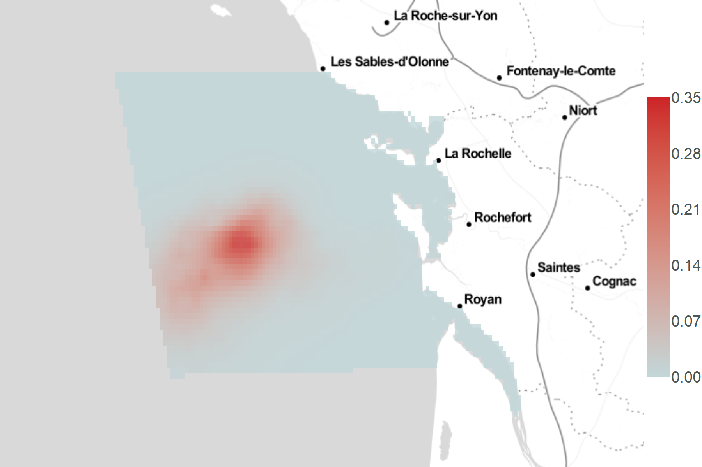
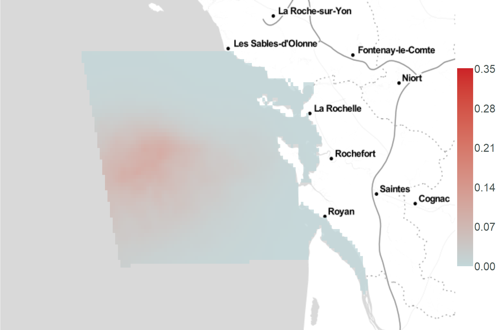

```{r setup, include=FALSE}
rm(list=ls())

knitr::opts_chunk$set(
	echo = FALSE,
	fig.align = "center",
	message = FALSE,
	warning = FALSE,
	error = TRUE
)
```

# Importations et transformation des données

## Importations

```{r import_packages}
# Gestion de donnees
library(dplyr)				# tidyverse
library(foreign)			# read.dbf
library(lubridate)		# dates
library(data.table)
library(plyr)

# Graphes packages
library(ggplot2) ; ggplot2::theme_set(theme_light())
library(ggmap)
library(viridis)
library(ggpubr)
library(plotly)

# Packages calcul
library(Distance)
library(dsm)

# Packages raster/carto
library(sp)
library(rgdal)
library(raster)
```

```{r import_donnees}
load("../data/effort_output.RData")
load("../data/list_prepare_obs_by_sp.RData")
load("../data/predata_output.RData")
gridata <- read.dbf("../data/SPEE_CAPECET_Grid2km_modified.dbf")
```

```{r import_functions}
# On importe les fonctions pour sélectionner les covariables (fonction de détection + dsm)
source("./shiny-app/fonctions/selec_detfc_aic.R")
source("./shiny-app/fonctions/selec_dsm_aic_fwd.R")

# On importe la fonction pred_splines
source("./shiny-app/fonctions/pred_splines.R")

# On importe les fonctions get_map_abundance
source("./shiny-app/fonctions/get_map_abundance.R")
source("./shiny-app/fonctions/get_map_abundance_app.R")
source("./shiny-app/fonctions/get_map_abundance_extr.R")
```

## Sélection des données

```{r}
# Jointure
distdata <- dplyr::left_join(list_prepare_obs_by_sp$PRIGLA_obs_output$obsdata,
																	 cov_segment <- predata_output$segdata,
																	 by = "Seg")

# Réarrangement des colonnes
distdata <- distdata[, c(3, 5:11, 1:2, 14:31)]
colnames(distdata)[1] = "Transect.Label"
colnames(distdata)[2] = "Seg"
colnames(distdata)[3] = "Sample.Label"
colnames(distdata)[5] = "session"


distdata$seaState = as.integer(distdata$seaState)
distdata$observerId <- as.integer(distdata$observerId)

# Changement de l'ordre des colonnes pour garder le même ordre pour les covariables que segdata
distdata <- distdata[, c(1:19, 24:28, 20:23)]
```

```{r}
obsdata <- list_prepare_obs_by_sp$PRIGLA_obs_output$obsdata
```

```{r}
segdata <- effort_output$segdata
```

```{r}
predata <- predata_output$predata
predata$session <- factor(predata$session)
unique(predata$session)

# Changement de l'ordre des colonnes pour garder le même ordre pour les covariables que segdata
predata <- predata[, c(1:6, 11:15, 7:10)]
```

On récupère les données suivantes :

-   `obsdata`, `segdate`et `predata`
-   `distdata`, une jointure entre predata et obsdata sur le segment

## Centrage-réduction

On centre et réduit les covariables (présentes dans `distdata`, `segdata` et `predata`).

```{r}
# On récupère mean et sd de segdata pour les colonnes 15 à 23
cov_names_mean_sd <- matrix(rep(NA, 9*2), ncol = 9)
colnames(cov_names_mean_sd) <- names(segdata[, 15:23])
rownames(cov_names_mean_sd) <- c("mean", "sd")

# moyenne
for (i in 1:9){
	cov_names_mean_sd[1,i] = mean(segdata[,i+14], na.rm = TRUE)
}
# sd
for (i in 1:9){
	cov_names_mean_sd[2,i] = sd(segdata[,i+14], na.rm = TRUE)
}
cov_names_mean_sd

# On centre-réduit les données de segdata, distdata et predata avec la moyenne et l'écart type de chaque covariable dans segdata

# segdata
for (i in 1:9){
	# On récupère la colonne du jeu de données non centré-réduit
	column <- as.data.frame(segdata[, grep(colnames(cov_names_mean_sd)[i], colnames(segdata))])
	
	# On récupère la moyenne et l'écart type pour cette covariable
	mean_cov <- cov_names_mean_sd[1, grep(colnames(cov_names_mean_sd)[i], colnames(cov_names_mean_sd))]
	sd_cov <- cov_names_mean_sd[2, grep(colnames(cov_names_mean_sd)[i], colnames(cov_names_mean_sd))]
	
	# On applique le centrage-réduction
	column <- apply(X = column, 
									MARGIN = 1, 
									FUN =  function(valeur){
										return((valeur - mean_cov)/sd_cov)
									}
	)
	segdata[i+14] = column
}

# distdata
for (i in 1:9){
	# On récupère la colonne du jeu de données non centré-réduit
	column <- as.data.frame(distdata[, grep(colnames(cov_names_mean_sd)[i], colnames(distdata))])
	
	# On récupère la moyenne et l'écart type pour cette covariable
	mean_cov <- cov_names_mean_sd[1, grep(colnames(cov_names_mean_sd)[i], colnames(cov_names_mean_sd))]
	sd_cov <- cov_names_mean_sd[2, grep(colnames(cov_names_mean_sd)[i], colnames(cov_names_mean_sd))]
	
	# On applique le centrage-réduction
	column <- apply(X = column, 
									MARGIN = 1, 
									FUN =  function(valeur){
										return((valeur - mean_cov)/sd_cov)
									}
	)
	distdata[i+19] = column
}

# predata
for (i in 1:9){
	# On récupère la colonne du jeu de données non centré-réduit
	column <- as.data.frame(predata[, grep(colnames(cov_names_mean_sd)[i], colnames(predata))])
	
	# On récupère la moyenne et l'écart type pour cette covariable
	mean_cov <- cov_names_mean_sd[1, grep(colnames(cov_names_mean_sd)[i], colnames(cov_names_mean_sd))]
	sd_cov <- cov_names_mean_sd[2, grep(colnames(cov_names_mean_sd)[i], colnames(cov_names_mean_sd))]
	
	# On applique le centrage-réduction
	column <- apply(X = column, 
									MARGIN = 1, 
									FUN =  function(valeur){
										return((valeur - mean_cov)/sd_cov)
									}
	)
	predata[i+6] = column
}
```

## Longitude, latitude en X et Y en lambert93

On recalcule X et Y en lambert 93 à cause d'un souci dans les données.

`predata`

```{r}
predata_save <- predata

## On récupère les coordonnées et on les transforme en Lambert 93
coordinates(predata) <- c("longitude", "latitude")
proj4string(predata) <- CRS("+init=epsg:4326") # Actuellement, epsg = 4326 : WGS84

## On créé un predata temporaire avec toutes les informations nécessaires
predata_l93 <- spTransform(predata, CRS("+init=epsg:2154")) # on veut, epsg = 2154 : Lambert93

## On récupère les coordonnées en X et Y
coord_l93 <- as.data.frame(coordinates(predata_l93))

## On remplace dans predata les X, Y faux par les nouvelles coordonnées X, Y en L93
predata <- predata_save
predata$X <- coord_l93$longitude
predata$Y <- coord_l93$latitude
```

`distdata`

```{r}
distdata_save <- distdata

## On récupère les coordonnées et on les transforme en Lambert 93
coordinates(distdata) <- c("longitude", "latitude")
proj4string(distdata) <- CRS("+init=epsg:4326") # Actuellement, epsg = 4326 : WGS84

## On créé un predata temporaire avec toutes les informations nécessaires
distdata_l93 <- spTransform(distdata, CRS("+init=epsg:2154")) # on veut, epsg = 2154 : Lambert93

## On récupère les coordonnées en X et Y
coord_l93 <- as.data.frame(coordinates(distdata_l93))

## On remplace dans predata les X, Y faux par les nouvelles coordonnées X, Y en L93
distdata <- distdata_save
distdata$X <- coord_l93$longitude
distdata$Y <- coord_l93$latitude
```

`gridata`

```{r}
gridata_save <- gridata
## On récupère les coordonnées et on les transforme en Lambert 93
coordinates(gridata) <- c("lon", "lat")
proj4string(gridata) <- CRS("+init=epsg:4326") # Actuellement, epsg = 4326 : WGS84

## On créé un predata temporaire avec toutes les informations nécessaires
gridata_l93 <- spTransform(gridata, CRS("+init=epsg:2154")) # on veut, epsg = 2154 : Lambert93

## On récupère les coordonnées en X et Y
coord_l93 <- as.data.frame(coordinates(gridata_l93))

## On remplace dans predata les X, Y faux par les nouvelles coordonnées X, Y en L93
gridata <- gridata_save
gridata$X <- coord_l93$lon
gridata$Y <- coord_l93$lat
```

```{r echo=FALSE}
# Nettoyage de l'environnement
rm(list = c("coord_l93", "cov_names_mean_sd", "cov_segment",
						"distata_l93", "effort_output", "list_prepare_obs_by_sp",
						"distdata_l93", "predata_l93", "gridata_l93",
						"predata_output", "column", "i", "mean_cov", "sd_cov",
						"gridata_save", "predata_save", "obsdata_save", "distdata_save"))
```

## Dates des sessions

```{r}
(data.frame(session = segdata$session,
					 date = segdata$date) %>%
	unique() %>%
	arrange(session, date) %>%
	group_by(session) %>%
	mutate(dates_session = paste0(date, collapse = " + ")))[,c(1,3)] %>%
	unique()
```

# Fonction de détection
## Sélection

On cherche à savoir quelle est la meilleure fonction de détection.

```{r}
res_detfc <-
	selec_detfc_aic(
		distancedata = distdata,
		list.cov = c("observerId", "seaState"),
		list.key = c("hn", "hr")
	)
res_detfc[[1]]
```

On choisit la fonction de détection avec l'AIC le plus faible. Ici, il s'agit de la fonction avec la formule `~1` et la key `hr`. A cause d'une erreur pour ajuster cette fonction seulement, on préferera prendre la fonction avec la formule `~seaState` et la key `hr`, qui a un AIC très très proche. On sélectionne donc la meilleure fonction de détection : `detfc.sea.hr`


```{r}
detfc.sea.hr <- Distance::ds(
						distdata,
						max(distdata$distance),
						formula = ~seaState,
						key = "hr")

summary(detfc.sea.hr)
```

## Résultats numériques et graphiques
### Avec plot.ds
```{r}
plot(
	detfc.sea.hr,
	hazard.params = list(xvar = distdata$distance, alpha = 0.02),
	lwd = 3,
	showpoints = F,
	pl.col = "lightblue",
	xlab = "",
	ylab = "",
	border = T
)
add_df_covar_line(detfc.sea.hr, data.frame(seaState = na.omit(unique(distdata$seaState))), lwd=2, pdf = TRUE)

legend(x = 0.2, y = 1, legend = c("0", "1", "2", "3"), lty=2:5)
```

### Manuellement, avec ggplot

On calcule manuellement les courbes de détection en fonction de l'état de la mer.

```{r, echo = TRUE}
# On récupère l'ensemble des paramètres du modèle d'abord
detfc_par <- detfc.sea.hr$ddf$par

# scale.value : fonction de mise à l'échelle des paramètres du modèle (matrice et exponentielle)
scale.value <- function (param, z){
	exp(as.matrix(z) %*% param) }

# key.fct.hz : On entre une distance, un sigma (scale), un b (shape) et on obtient une probabilité de détection pour une hazard-rate
key.fct.hr <- function (distance, sigma, b){
	return(1 - exp(-(distance / sigma) ^ (-b))) }

# On créé un vecteur des distances de 0 à 0.3 km
dist <- seq(from = 0, to = 0.3, length.out = 96)

# On récupère le paramètre shape (b) et on le met à l'échelle : 100 fois exp(b)
b <- scale.value(detfc_par["V1"], matrix(1, nrow = 96, 1))

# On va ensuite récupérer le paramètre scale (sigma)
# C'est plus compliqué ici, car sigma varie selon les covariables de détection, donc seaState ici.

# sigma.0 : intercept
sigma0 <- scale.value(detfc_par[2:3], # 2 paramètres : sigma intercept + sigma seaState = 0
											z = matrix(c(rep(1, 96), rep(0, 96)), ncol = 2))

# sigma.1 : intercept + seaState toujours à 1
sigma1 <- scale.value(detfc_par[2:3], # 2 paramètres : sigma intercept + sigma seaState = 1
											z = matrix(rep(1, 96*2), ncol = 2))

# sigma.2 : intercept + seaState toujours à 2
sigma2 <- scale.value(detfc_par[2:3], # 2 paramètres : sigma intercept + sigma seaState constant à 2
											z = matrix(c(rep(1, 96), rep(2, 96)), ncol = 2))

# sigma.3 : intercept + seaState toujours à 3
sigma3 <- scale.value(detfc_par[2:3], # 2 paramètres : sigma intercept + sigma seaState constant à 2
											z = matrix(c(rep(1, 96), rep(3, 96)), ncol = 2))


# A partir de tous ces paramètres et du vecteur des distances, on calcule la probabilité de détection
proba_detec0 <- key.fct.hr(distance = dist, sigma = sigma0, b = b)
proba_detec1 <- key.fct.hr(distance = dist, sigma = sigma1, b = b)
proba_detec2 <- key.fct.hr(distance = dist, sigma = sigma2, b = b)
proba_detec3 <- key.fct.hr(distance = dist, sigma = sigma3, b = b)
```

On va ensuite générer le graphique correspondant.

```{r}
plot_detfc <- distdata %>% 
  ggplot(aes(x = distance)) +
	geom_histogram(aes(y = ..count../10, 
										 fill = factor(seaState),
										 text = paste("Number of sharks:", ..count..)),
								 binwidth = 0.02, col="white", alpha = .3) +
	
	geom_line(data = data.frame(x = dist, y = proba_detec0),
						aes(x = x, y = y, text="Beaufort = 0"),
						col = "#54C3C7", size = 1.5, lty = 1) +
	
	geom_line(data = data.frame(x = dist, y = proba_detec1), 
						aes(x = x, y = y, text="Beaufort = 1"),
						col = "#3C8C8F", size = 1.5) +
	
	geom_line(data = data.frame(x = dist, y = proba_detec2),
						aes(x = x, y = y, text="Beaufort = 2"),
						col = "#2B6466", size = 1.5) +

	geom_line(data = data.frame(x = dist, y = proba_detec3),
						aes(x = x, y = y, text="Beaufort = 3"),
						col = "#1A3C3D", size = 1.5) +
	# Nom des axes
	xlab("Distance (km)") +
	ylab("Detection probability") +
	labs(fill = "Beaufort") +
	theme(
		panel.grid.major = element_blank(),
		panel.grid.minor = element_blank(),
		panel.background = element_blank()
	) +
	scale_fill_manual(values = c("#54C3C7", "#3C8C8F", "#2B6466", "#1A3C3D"))

ggplotly(plot_detfc, tooltip = "text") %>% layout(legend = list(title = list(text="Beaufort\n"), x = 0.6, y = 0.6))

```
On enregistre ce graphique dans le dossier img en 2 versions, en anglais et en français, pour le poster.

```{r}
# Français
png("./img/plot_fndet_fr.png", width = 1200, height = 750)

plot <- ggplot(distdata, aes(x = distance)) +
	geom_histogram(aes(y = ..count../10, fill = factor(seaState)), binwidth = 0.02, col = "white", alpha = .3) +
	geom_line(data = data.frame(x = dist, y = proba_detec0), aes(x = x, y = y), col = "#54C3C7", size = 1.5) +
	geom_line(data = data.frame(x = dist, y = proba_detec1), aes(x = x, y = y), col = "#3C8C8F", size = 1.5) +
	geom_line(data = data.frame(x = dist, y = proba_detec2), aes(x = x, y = y), col = "#2B6466", size = 1.5) +
	geom_line(data = data.frame(x = dist, y = proba_detec3), aes(x = x, y = y), col = "#1A3C3D", size = 1.5) +
	# Nom des axes
	xlab("Distance (km)") +
	ylab("Probabilité de détection") +
	labs(fill = "Beaufort") +
	theme(
		axis.text = element_text(size = 30, colour = "#141414"),
		axis.title = element_text(size = 40, colour = "#141414"),
		legend.text = element_text(size = 30, colour = "#141414"),
		legend.title = element_text(size = 30, colour = "#141414"),
		panel.grid.major = element_blank(),
		panel.grid.minor = element_blank(),
		panel.background = element_blank()
	) +
	scale_fill_manual(values = c("#54C3C7", "#3C8C8F", "#2B6466", "#1A3C3D"))
plot

dev.off()

# Anglais
png("./img/plot_fndet_en.png", width = 1200, height = 750)

plot <- ggplot(distdata, aes(x = distance)) +
	geom_histogram(aes(y = ..count../10, fill = factor(seaState)), binwidth = 0.02, col = "white", alpha = .3) +
	geom_line(data = data.frame(x = dist, y = proba_detec0), aes(x = x, y = y), col = "#54C3C7", size = 1.5) +
	geom_line(data = data.frame(x = dist, y = proba_detec1), aes(x = x, y = y), col = "#3C8C8F", size = 1.5) +
	geom_line(data = data.frame(x = dist, y = proba_detec2), aes(x = x, y = y), col = "#2B6466", size = 1.5) +
	geom_line(data = data.frame(x = dist, y = proba_detec3), aes(x = x, y = y), col = "#1A3C3D", size = 1.5) +
	# Nom des axes
	xlab("Distance (km)") +
	ylab("Detection probability") +
	labs(fill = "Beaufort") +
	theme(
		axis.text = element_text(size = 30, colour = "#141414"),
		axis.title = element_text(size = 40, colour = "#141414"),
		legend.text = element_text(size = 30, colour = "#141414"),
		legend.title = element_text(size = 30, colour = "#141414"),
		panel.grid.major = element_blank(),
		panel.grid.minor = element_blank(),
		panel.background = element_blank()
	) +
	scale_fill_manual(values = c("#54C3C7", "#3C8C8F", "#2B6466", "#1A3C3D"))
plot

dev.off()
```
Nous avons aussi tenté en mettant les modalités beaufort 0-1 ensemble et 2-3 ensemble, pour voir si nous avions toujours une meilleure détection avec une mer plus agitée.
```{r}
## Transformer seaState en 2 modalités
distdata$seaState<-as.character(distdata$seaState)
distdata$seaState<-revalue(distdata$seaState, c("0"="agitation faible","1"="agitation faible", "2"="agitation modérée","3"="agitation modérée"))
segdata$seaState<-as.character(segdata$seaState)
segdata$seaState<-revalue(segdata$seaState, c("0"="agitation faible","1"="agitation faible", "2"="agitation modérée","3"="agitation modérée"))

## Ajustement fonction de détection
detfc.sea.hr <- Distance::ds(
						distdata,
						max(distdata$distance),
						formula = ~seaState,
						key = "hr")

# On récupère l'ensemble des paramètres du modèle d'abord
detfc_par <- detfc.sea.hr$ddf$par

# scale.value : fonction de mise à l'échelle des paramètres du modèle (matrice et exponentielle)
scale.value <- function (param, z){
	exp(as.matrix(z) %*% param) }

# key.fct.hz : On entre une distance, un sigma (scale), un b (shape) et on obtient une probabilité de détection pour une hazard-rate
key.fct.hr <- function (distance, sigma, b){
	return(1 - exp(-(distance / sigma) ^ (-b))) }

# On créé un vecteur des distances de 0 à 0.3 km
dist <- seq(from = 0, to = 0.3, length.out = 96)

# On récupère le paramètre shape (b) et on le met à l'échelle : 100 fois exp(b)
b <- scale.value(detfc_par["V1"], matrix(1, nrow = 96, 1))

# On va ensuite récupérer le paramètre scale (sigma)
# C'est plus compliqué ici, car sigma varie selon les covariables de détection, donc seaState ici.

# sigma.0 : intercept
sigma0 <- scale.value(detfc_par[2:3], # 2 paramètres : sigma intercept + sigma seaState = 0
											z = matrix(c(rep(1, 96), rep(0, 96)), ncol = 2))

# sigma.1 : intercept + seaState toujours à 1
sigma1 <- scale.value(detfc_par[2:3], # 2 paramètres : sigma intercept + sigma seaState = 1
											z = matrix(c(rep(1, 96),rep(1,96)), ncol = 2))

# A partir de tous ces paramètres et du vecteur des distances, on calcule la probabilité de détection
proba_detec0 <- key.fct.hr(distance = dist, sigma = sigma0, b = b)
proba_detec1 <- key.fct.hr(distance = dist, sigma = sigma1, b = b)

## plot
plot_detfc <- distdata %>% 
  ggplot(aes(x = distance)) +
	geom_histogram(aes(y = ..count../10, 
										 fill = factor(seaState),
										 text = paste("Number of sharks:", ..count..)),
								 binwidth = 0.02, col="white", alpha = .3) +
	
	geom_line(data = data.frame(x = dist, y = proba_detec0),
						aes(x = x, y = y, text="Beaufort = agitation faible"),
						col = "#54C3C7", size = 1.5, lty = 1) +
	
	geom_line(data = data.frame(x = dist, y = proba_detec1), 
						aes(x = x, y = y, text="Beaufort = agitation modérée"),
						col = "#3C8C8F", size = 1.5) +
	

	xlab("Distance (km)") +
	ylab("Detection probability") +
	labs(fill = "Beaufort") +
	theme(
		panel.grid.major = element_blank(),
		panel.grid.minor = element_blank(),
		panel.background = element_blank()
	) +
	scale_fill_manual(values = c("#54C3C7", "#3C8C8F"))

ggplotly(plot_detfc, tooltip = "text") %>% layout(legend = list(title = list(text="Beaufort\n"), x = 0.6, y = 0.6))
```


# Fonction de densité (covariables communes par session)


## Analyse préliminaire : corrélation des covariables

```{r}
library(corrplot)
corrplot(cor(segdata[,15:23]), method="circle")
corrplot(cor(predata[,7:15]), method="circle")
```

```{r}
library(FactoMineR)

FactoMineR::PCA(predata[,7:15])
```

## Sélection des covariables

On utilise la fonction `selec_dsm_aic_fwd` qui va permettre de sélectionner de manière forward les covariables à inclure dans le modèle dsm.

Cette fonction prend en arguments segdata, obsdata, la fonction de détection et un vecteur de toutes les covariables à tester. C'est une fonction récursive, elle peut donc aussi prendre en argument un vecteur des covariables déjà sélectionnées.

> On sélectionne les covariables sur l'ensemble des données, sans distinction de session.
> Ici, les AIC sont données pour `availability = 1`. L'algorithme pour les autres valeurs de disponibilité sélectionne les même covariables, seul l'AIC change.

```{r}
vct.spline.test = c("s(X, Y)", "s(depth)", "s(slopeP)", "s(distCoast)", "s(dist200)", "s(CHL_4w_mea)", "s(CHL_4w_sd)", "s(SST_4w_mea)", "s(SST_4w_sd)", "s(POC_4w_mea)")

selec_dsm_av1 <- selec_dsm_aic_fwd(segdata = segdata, obsdata = obsdata, 
									detfc = detfc.sea.hr,
									vct.spline.test = vct.spline.test,
									availability = 1)
selec_dsm_av1
dsm_av1 <- selec_dsm_av1$dsm.selec
dsm_av1.pred <- predict(dsm_av1, predata, predata$Area)
```

## Ajustement de la fonction de densité

> dsm pour $availability$ dépendante de on-shelf et off-shelf : On note "on-shelf" quand la profondeur est inférieure à 150m, et "off-shelf" si la profondeur est supérieure à 150m.

$$availability_{off-shelf}=0,1357617$$
$$availability_{on-shelf}=0,6332016$$

```{r}
segdata_tmp <- segdata %>% filter(month(date) == 5 | month(date) == 6)
obsdata_tmp <- obsdata %>% filter(session == 2)

# On choisit s(X, Y)
dsm_s2_av1 <- dsm(
				formula = count ~ s(SST_4w_mea) + s(X, Y) + s(CHL_4w_mea),
				ddf.obj = detfc.sea.hr,
				segment.data = segdata_tmp,
				observation.data = obsdata_tmp,
				method = 'REML',
				family = nb(),
				engine = 'gam',
				gamma = 1.4,
				availability = 1)


segdata_tmp <- segdata %>% filter(month(date) == 7 | month(date) == 8)
obsdata_tmp <- obsdata %>% filter(session == 3)

dsm_s3_av1 <- dsm(
				formula = count ~ s(SST_4w_mea) + s(X, Y) + s(CHL_4w_mea),
				ddf.obj = detfc.sea.hr,
				segment.data = segdata_tmp,
				observation.data = obsdata_tmp,
				method = 'REML',
				family = nb(),
				engine = 'gam',
				gamma = 1.4,
				availability = 1)


segdata_tmp <- segdata %>% filter(month(date) == 5 | month(date) == 6)
obsdata_tmp <- obsdata %>% filter(session == 2)

dsm_s2_av041 <- dsm(
				formula = count ~ s(SST_4w_mea) + s(X, Y) + s(CHL_4w_mea),
				ddf.obj = detfc.sea.hr,
				segment.data = segdata_tmp,
				observation.data = obsdata_tmp,
				method = 'REML',
				family = nb(),
				engine = 'gam',
				gamma = 1.4,
				availability = 0.41)


segdata_tmp <- segdata %>% filter(month(date) == 7 | month(date) == 8)
obsdata_tmp <- obsdata %>% filter(session == 3)

dsm_s3_av041 <- dsm(
				formula = count ~ s(SST_4w_mea) + s(X, Y) + s(CHL_4w_mea),
				ddf.obj = detfc.sea.hr,
				segment.data = segdata_tmp,
				observation.data = obsdata_tmp,
				method = 'REML',
				family = nb(),
				engine = 'gam',
				gamma = 1.4,
				availability = 0.41)

# On-shelf/off-shelf

distdata$availability = NA
for (i in 1:nrow(distdata)) {
	if (distdata$depth[i] <= 150) {
		distdata$availability[i] = 0.6332016
	} else{
		distdata$availability[i] = 0.1357617
	}
}

segdata_tmp <- segdata %>% filter(month(date) == 5 | month(date) == 6)
obsdata_tmp <- obsdata %>% filter(session == 2)
availability <- (distdata %>% filter(session == 2))$availability

dsm_s2_avshelf <- dsm(
				formula = count ~ s(SST_4w_mea) + s(X, Y) + s(CHL_4w_mea),
				ddf.obj = detfc.sea.hr,
				segment.data = segdata_tmp,
				observation.data = obsdata_tmp,
				method = 'REML',
				family = nb(),
				engine = 'gam',
				gamma = 1.4,
				availability = availability)

segdata_tmp <- segdata %>% filter(month(date) == 7 | month(date) == 8)
obsdata_tmp <- obsdata %>% filter(session == 3)
availability <- (distdata %>% filter(session == 3))$availability

dsm_s3_avshelf <- dsm(
				formula = count ~ s(SST_4w_mea) + s(X, Y) + s(CHL_4w_mea),
				ddf.obj = detfc.sea.hr,
				segment.data = segdata_tmp,
				observation.data = obsdata_tmp,
				method = 'REML',
				family = nb(),
				engine = 'gam',
				gamma = 1.4,
				availability = availability)
```


# Prédiction de l'abondance et de la répartition

On créé deux tableaux de données `predata_tmp` dont les valeurs correspondent aux valeurs de predata pour chaque session.

```{r}
predata_tmp2 <- predata %>% filter(session == 2)
predata_tmp3 <- predata %>% filter(session == 3)

dsm_s2_av1.pred <- predict(dsm_s2_av1, predata_tmp2, predata_tmp2$Area, se.fit = TRUE)
dsm_s3_av1.pred <- predict(dsm_s3_av1, predata_tmp3, predata_tmp3$Area, se.fit = TRUE)

dsm_s2_av041.pred <- predict(dsm_s2_av041, predata_tmp2, predata_tmp2$Area, se.fit = TRUE)
dsm_s3_av041.pred <- predict(dsm_s3_av041, predata_tmp3, predata_tmp3$Area, se.fit = TRUE)

dsm_s2_avshelf.pred <- predict(dsm_s2_avshelf, predata_tmp2, predata_tmp2$Area, se.fit = TRUE)
dsm_s3_avshelf.pred <- predict(dsm_s3_avshelf, predata_tmp3, predata_tmp3$Area, se.fit = TRUE)
```

## Abondances estimées selon la disponibilité et la session

```{r}
res_abondance <- data.frame(
	"Session" = c(2, 3, 2, 3, 2, 3),
	"Disponibilité" = c("1", "1", "0.41", "0.41", "on-shelf/off-shelf", "on-shelf/off-shelf"),
	"Min" = c(
		sum(dsm_s2_av1.pred$fit - (dsm_s2_av1.pred$se.fit)),
		sum(dsm_s3_av1.pred$fit - (dsm_s3_av1.pred$se.fit)),
		sum(dsm_s2_av041.pred$fit - (dsm_s2_av1.pred$se.fit)),
		sum(dsm_s3_av041.pred$fit - (dsm_s3_av1.pred$se.fit)),
		sum(dsm_s2_avshelf.pred$fit - (dsm_s2_av1.pred$se.fit)),
		sum(dsm_s3_avshelf.pred$fit - (dsm_s3_av1.pred$se.fit))
	),
	"Estimation" = c(
		sum(dsm_s2_av1.pred$fit),
		sum(dsm_s3_av1.pred$fit),
		sum(dsm_s2_av041.pred$fit),
		sum(dsm_s3_av041.pred$fit),
		sum(dsm_s2_avshelf.pred$fit),
		sum(dsm_s3_avshelf.pred$fit)
	),
	"Max" = c(
		sum(dsm_s2_av1.pred$fit + (dsm_s2_av1.pred$se.fit)),
		sum(dsm_s3_av1.pred$fit + (dsm_s3_av1.pred$se.fit)),
		sum(dsm_s2_av041.pred$fit + (dsm_s2_av1.pred$se.fit)),
		sum(dsm_s3_av041.pred$fit + (dsm_s3_av1.pred$se.fit)),
		sum(dsm_s2_avshelf.pred$fit + (dsm_s2_av1.pred$se.fit)),
		sum(dsm_s3_avshelf.pred$fit + (dsm_s3_av1.pred$se.fit))
	)
)

data.table::data.table(res_abondance)
```
```{r}
res_abondance <- data.frame(
	"Session" = c(2, 3, 2, 3, 2, 3),
	"Disponibilité" = c("1", "1", "0.41", "0.41", "on-shelf/off-shelf", "on-shelf/off-shelf"),
	"Estimation" = c(
		sum(dsm_s2_av1.pred$fit),
		sum(dsm_s3_av1.pred$fit),
		sum(dsm_s2_av041.pred$fit),
		sum(dsm_s3_av041.pred$fit),
		sum(dsm_s2_avshelf.pred$fit),
		sum(dsm_s3_avshelf.pred$fit)
	),
	"Plus ou moins" = c(
		sum(dsm_s2_av1.pred$se.fit),
		sum(dsm_s3_av1.pred$se.fit),
		sum(dsm_s2_av041.pred$se.fit),
		sum(dsm_s3_av041.pred$se.fit),
		sum(dsm_s2_avshelf.pred$se.fit),
		sum(dsm_s3_avshelf.pred$se.fit)
	)
)

data.table::data.table(res_abondance)
```


## Cartes statiques (poster)

```{r}
# Création de la carte vide
empty.map <- ggmap(get_stamenmap(
	bbox = make_bbox(
		lon = c(min(distdata$longitude), max(distdata$longitude)+0.8),
		lat = c(min(distdata$latitude), max(distdata$latitude)),
		f = 0.4
	),
	zoom = 8,
	maptype = "toner-lite"
))

empty.map2 <- ggmap(get_stamenmap(
	bbox = make_bbox(
		lon = c(min(distdata$longitude), max(distdata$longitude)+0.8),
		lat = c(min(distdata$latitude), max(distdata$latitude)),
		f = 0.4
	),
	zoom = 8,
	maptype = "terrain"
))
```

On créé maintenant toutes les cartes statiques. Ce sont celles que l'on retrouve sur le poster. Elles vont également être enregistrées dans le dossier img.

### Session 2 et availability = 1

```{r}
map <- get_map_abundance(
	empty.map = empty.map,
	dsm.pred = dsm_s2_av1.pred$fit,
	predata_tmp = predata_tmp2,
	session_selec = 2,
	segdata = segdata,
	distdata = distdata,
	abondance = TRUE,
	transects = FALSE,
	observations = FALSE,
	poster = TRUE
)

png("./img/dsm_s2_av1.pred.png",
		width = 1800,
		height = 1200)
map
dev.off()
```


### Session 3 et availability = 1

```{r}
map <- get_map_abundance(
	empty.map = empty.map,
	dsm.pred = dsm_s3_av1.pred$fit,
	predata_tmp = predata_tmp3,
	session_selec = 3,
	segdata = segdata,
	distdata = distdata,
	abondance = TRUE,
	transects = FALSE,
	observations = FALSE,
	poster = TRUE
)

png("./img/dsm_s3_av1.pred.png", width = 1800, height = 1200)
map
dev.off()
```



### Session 2 et availability = 0.41

```{r}
map <- get_map_abundance(
	empty.map = empty.map,
	dsm.pred = dsm_s2_av041.pred$fit,
	predata_tmp = predata_tmp2,
	session_selec = 2,
	segdata = segdata,
	distdata = distdata,
	abondance = TRUE,
	transects = FALSE,
	observations = FALSE,
	poster = TRUE
)

png("./img/dsm_s2_av041.pred.png", width = 1800, height = 1200)
map
dev.off()
```


### Session 3 et availability = 0.41

```{r}
map <- get_map_abundance(
	empty.map = empty.map,
	dsm.pred = dsm_s3_av041.pred$fit,
	predata_tmp = predata_tmp3,
	session_selec = 3,
	segdata = segdata,
	distdata = distdata,
	abondance = TRUE,
	transects = FALSE,
	observations = FALSE,
	poster = TRUE
)

png("./img/dsm_s3_av041.pred.png",
		width = 1800,
		height = 1200)
map
dev.off()
```


### Session 2 et availability = off/on shelf

```{r}
map <- get_map_abundance(
	empty.map = empty.map,
	dsm.pred = dsm_s2_avshelf.pred$fit,
	predata_tmp = predata_tmp2,
	session_selec = 2,
	segdata = segdata,
	distdata = distdata,
	abondance = TRUE,
	transects = FALSE,
	observations = FALSE,
	poster = TRUE
)

png("./img/dsm_s2_avshelf.pred.png",
		width = 1800,
		height = 1200)
map
dev.off()
```




### Session 3 et availability = off/on shelf

```{r}
map <- get_map_abundance(
	empty.map = empty.map,
	dsm.pred = dsm_s3_avshelf.pred$fit,
	predata_tmp = predata_tmp3,
	session_selec = 3,
	segdata = segdata,
	distdata = distdata,
	abondance = TRUE,
	transects = FALSE,
	observations = FALSE,
	poster = TRUE
)
map

png("./img/dsm_s3_avshelf.pred.png",
		width = 1800,
		height = 1200)
map
dev.off()
```


## Cartes interactives (application shiny)

On obtient aussi une carte interactive par session, qui sont celles que l'on retrouve dans l'application. 

### Session 2
```{r}
get_map_abundance_app(
	empty.map = empty.map,
	dsm.pred.1 = dsm_s2_av1.pred,
	dsm.pred.041 = dsm_s2_av041.pred,
	dsm.pred.shelf = dsm_s2_avshelf.pred,
	predata_tmp = predata_tmp2,
	session_selec = 2,
	segdata = segdata,
	distdata = distdata,
	abondance = TRUE,
	transects = TRUE,
	observations = TRUE
)
```

### Session 3
```{r}
get_map_abundance_app(
	empty.map = empty.map,
	dsm.pred.1 = dsm_s3_av1.pred,
	dsm.pred.041 = dsm_s3_av041.pred,
	dsm.pred.shelf = dsm_s3_avshelf.pred,
	predata_tmp = predata_tmp3,
	session_selec = 3,
	segdata = segdata,
	distdata = distdata,
	abondance = TRUE,
	transects = TRUE,
	observations = TRUE
)
```

# Effets des covariables sélectionnées
## Visualisation des splines correspondantes au dsm

On enregistre plusieurs images dans le dossier img : par session et biais de disponibilité, on a une image avec toutes les splines et une image avec X et Y en plus grand.

```{r fig.height = 6, fig.width = 12}

for (session_choix in 2:3){
	for (availability_choix in c("1", "041", "shelf")){
		# créé png
		eval(parse(text = paste0('png("./img/dsm_cov_s', session_choix, 
														 '_av', availability_choix, '.pred.all.png", width = 700, height = 1000)')))
		# plot
		par(mfrow = c(3, 1), cex = 1.1, mar = c(5,5,5,5))
		eval(parse(text = paste0("plot.gam(dsm_s", session_choix, "_av", availability_choix, ")")))
		# écrit png et ferme
		dev.off()
		
		# Graphes plus grands pour X et Y
		if (session_choix == 2 ){saison = "Printemps"} else {saison = "Eté"}
		if (availability_choix == "shelf" ){biaisdispo = "on-shelf/off-shelf"} 
		if (availability_choix == "1" ){biaisdispo = "1"} 
		if (availability_choix == "041"){biaisdispo = "0,41"} 

		# créé png
		eval(parse(text = paste0('png("./img/dsm_cov_s', session_choix, 
														 '_av', availability_choix, '.pred.png", width = 700, height = 400)')))
		eval(parse(text = paste0("plot.gam(dsm_s", session_choix, "_av", availability_choix,
														 ", main = 'Session : ",saison, "     |     Biais de disponibilité = ", biaisdispo, "', select = 2)")))
		dev.off()
	}
}
```

Voici par exemple l'image pour la sessio 2 (printemps), un biais de 1 et toutes les covariables.


## Cartes des covariables SST et Chlorophylle

On récupère les predata avec les covariables non centrées-réduites.
```{r}
load("../data/predata_output.RData")
predata_brut <- predata_output$predata
predata_brut$session <- factor(predata_brut$session)
predata_brut <- predata_brut[, c(1:6, 11:15, 7:10)]
predata_brut_tmp2 <- predata_brut %>% filter(session == 2)
predata_brut_tmp3 <- predata_brut %>% filter(session == 3)
```

## Chlorophylle
```{r}
get_map_CHL <- function(CHL_mean,
												predata_tmp,
												empty.map,
												pal) {
	# Carte vide
	res <- empty.map
	
	# Raster de covariable
	res <- res +
		geom_raster(
			data = as.data.frame(
				cbind(
					x = predata_tmp$longitude,
					y = predata_tmp$latitude,
					Chlorophylle = CHL_mean
				)
			),
			aes(
				x = x,
				y = y,
				fill = Chlorophylle
			),
			alpha = 0.8
		) +
		coord_fixed(ratio = 1.5) +
		scale_fill_gradientn(
			colours = pal
		)  +
		labs(fill = "Chlorophylle a\n(mg/m\U00B3)")
	
	# Thème et couleurs
	res <- res +
		theme_void()
	
	return(res)
}
```

```{r}
# Printemps
map_CHL_s2 <- get_map_CHL(CHL_mean = predata_brut_tmp2$CHL_4w_mea,
						predata_tmp = predata_brut_tmp2,
						empty.map = empty.map2,
						pal = c("#DCF587", "#2B751D"))

map_CHL_s2 <- map_CHL_s2 + 
	labs(title = "Teneur en chlorophylle a au printemps") + 
	theme(plot.title = element_text(hjust = 0.5))
map_CHL_s2

# Ete
map_CHL_s3 <- get_map_CHL(CHL_mean = predata_brut_tmp3$CHL_4w_mea,
						predata_tmp = predata_brut_tmp3,
						empty.map = empty.map2,
						pal = c("#DCF587", "#2B751D"))

map_CHL_s3 <- map_CHL_s3 + 
	labs(title = "Teneur en chlorophylle a en été") + 
	theme(plot.title = element_text(hjust = 0.5))
map_CHL_s3
```

## SST

```{r}
get_map_SST <- function(SST_mean,
												predata_tmp,
												empty.map,
												pal) {
	# Carte vide
	res <- empty.map
	
	# Raster de covariable
	res <- res +
		geom_raster(
			data = as.data.frame(
				cbind(
					x = predata_tmp$longitude,
					y = predata_tmp$latitude,
					SST = SST_mean
				)
			),
			aes(
				x = x,
				y = y,
				fill = SST
			),
			alpha = 0.8
		) +
		coord_fixed(ratio = 1.5) +
		scale_fill_gradientn(
			colours = pal
		)  +
		labs(fill = "Température \nà la surface\nde la mer (°C)")
	
	# Thème et couleurs
	res <- res +
		theme_void()
	
	return(res)
}
```

```{r}
# Printemps
map_SST_s2 <- get_map_SST(SST_mean = predata_brut_tmp2$SST_4w_mea,
						predata_tmp = predata_brut_tmp2,
						empty.map = empty.map2,
						pal = c("#A7DBD8", "#F5AB2E"))

map_SST_s2 <- map_SST_s2 + 
	labs(title = "Température à la surface de la mer au printemps") + 
	theme(plot.title = element_text(hjust = 0.5))
map_SST_s2

# Ete
map_SST_s3 <- get_map_SST(SST_mean = predata_brut_tmp3$SST_4w_mea,
						predata_tmp = predata_brut_tmp3,
						empty.map = empty.map2,
						pal = c("#A7DBD8", "#F5AB2E"))

map_SST_s3 <- map_SST_s3 + 
	labs(title = "Température à la surface de la mer en été") + 
	theme(plot.title = element_text(hjust = 0.5))
map_SST_s3
```

On retrouve toutes les cartes ci-dessous :
```{r, fig.width=14, fig.height=10}
ggarrange(map_CHL_s2, map_CHL_s3,
					map_SST_s2, map_SST_s3)
```

# Exportation des résultats en Rdata

On exporte certains résultats en Rdata qui seront utilisés pour l'application shiny.
```{r}
# Fonction de détection
save(detfc.sea.hr, plot_detfc,
		 file = "shiny-app/data/detfc.Rdata")


# Modèles : dsm
save(dsm_s2_av1, dsm_s2_av041, dsm_s2_avshelf,
		 dsm_s3_av1, dsm_s3_av041, dsm_s3_avshelf,
		 file = "shiny-app/data/modeles_dsm.RData")

# Résultats de la prédiction : dsm.pred
save(dsm_s2_av1.pred, dsm_s2_av041.pred, dsm_s2_avshelf.pred,
		 dsm_s3_av1.pred, dsm_s3_av041.pred, dsm_s3_avshelf.pred,
		 file = "shiny-app/data/modeles_dsm.pred.RData")

# Données nettoyées
save(obsdata, predata, predata_tmp2, predata_tmp3, segdata, distdata,
		 file = "../data/donnees_nettoyees.RData")
```
